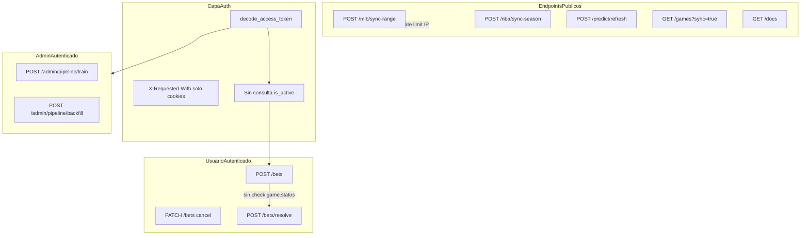

# Auditoría de Seguridad — Backend Sports Predictions

**Modelo:** Composer 2.5  
**Fecha:** 21 de junio de 2026  
**Alcance:** Revisión completa de `backend/src/app/` — autenticación, autorización, lógica de negocio (apuestas), pipeline ML/admin, integraciones externas (MLB/NBA/Open-Meteo/Google OAuth), configuración y CLI.  
**Metodología:** Análisis estático del código fuente (~130 archivos Python); trazado de flujos OAuth → JWT → `/bets/*` y admin pipeline; cruce con [`docs/security/SECURITY-AUDIT-REPORT.md`](../docs/security/SECURITY-AUDIT-REPORT.md) y [`Auditoria_seguridad_sonnet4.6_Jun_21.md`](Auditoria_seguridad_sonnet4.6_Jun_21.md). **No se ejecutaron pruebas dinámicas** (fuzzing, pentest activo).

---

## Resumen ejecutivo

Se identificaron **32 hallazgos confirmados** en análisis estático: 2 críticos, 10 altos, 17 medios y 3 bajos/informativos. Ninguna credencial de producción está en el repositorio git (`.env` correctamente ignorado). Los riesgos más graves no son inyecciones SQL ni XSS, sino **fallos de diseño en sesiones, OAuth, integridad del tracker de apuestas y abuso de recursos sin autenticación**.

### Top 5 riesgos

1. **Takeover de cuenta vía OAuth** — vinculación silenciosa Google ↔ email/password sin verificación de contraseña ni `email_verified` (C-01).
2. **Apuestas retroactivas en partidos finalizados** — `create_bet` no valida estado del juego; odds/stake controlados por el cliente (C-02).
3. **JWT sin revalidación en BD** — cuentas desactivadas y tokens robados siguen operando hasta expirar (7 d user / 240 min admin) (A-01).
4. **Endpoints write costosos sin autenticación** — sync MLB/NBA, refresh predicciones, `GET /games?sync=true` abusables por cualquier IP (A-08).
5. **Deserialización joblib sin confinamiento** — `ML_MODEL_PATH` arbitrario → RCE si se coloca un `.joblib` malicioso (A-09).

| Severidad | Cantidad |
|-----------|----------|
| Crítica   | 2        |
| Alta      | 10       |
| Media     | 17       |
| Baja      | 3        |

### Relación con auditoría Sonnet 4.6

Este informe **incorpora y expande** los 13 hallazgos de [`Auditoria_seguridad_sonnet4.6_Jun_21.md`](Auditoria_seguridad_sonnet4.6_Jun_21.md). Correspondencias aproximadas:

| Sonnet | Composer | Notas |
|--------|----------|-------|
| A-01 | A-01 | JWT usuario sin `is_active` |
| A-02 | A-04 | Reactivación OAuth |
| A-03 | A-10 | Fuga PostgreSQL en errores |
| M-01 | M-10 | Rate limit multi-worker |
| M-02 | M-14 | Secretos en subprocess train |
| M-03 | M-17 | Logs OAuth |
| M-04 | A-01 (admin) | JWT admin sin revocación |
| M-05 | M-04 | Enumeración emails |
| M-06 | M-03 | Sin rate limit auth usuario |
| B-01 | B-02 | Endpoints `/ready` |
| B-02 | — | `picture_url` (cubierto en controles positivos frontend) |
| B-03 | — | Sin `.gitignore` en backend (informativo, no repetido) |

**Nuevo en Composer 2.5:** lógica de negocio de apuestas (7 hallazgos), escalada cross-realm JWT, ghost admin, joblib RCE, mapa de endpoints públicos abusables, análisis IDOR explícito.

---

## Metodología y superficie de ataque

### Componentes revisados

- **Auth:** `api/deps_user.py`, `api/deps_admin.py`, `services/user_auth.py`, `services/admin_auth.py`, `core/admin_security.py`, `api/routes/user_auth.py`, `api/routes/admin.py`
- **Apuestas:** `services/bets_service.py`, `services/bets_resolver.py`, `api/routes/bets.py`, `schemas/bets_api.py`
- **API pública:** `routes/games.py`, `routes/mlb.py`, `routes/nba.py`, `routes/predict.py`
- **ML/Admin:** `ml/predictor.py`, `services/model_registry.py`, `api/routes/admin.py`
- **Infra:** `main.py`, `core/config.py`, `core/exception_handlers.py`, `api/deps_rate_limit.py`, `cli/*`

### Mapa de arquitectura de seguridad



---

## Hallazgos Críticos

---

### C-01 · Takeover de cuenta OAuth bidireccional (vinculación silenciosa + registro previo)

**Archivos:** `src/app/services/user_auth.py:25–36`, `src/app/api/routes/user_auth.py:263–282`  
**Confianza:** 0.96

**Código vulnerable:**
```python
# services/user_auth.py
if existing is not None:
    existing.google_id = google_id
    existing.display_name = display_name or existing.display_name
    existing.picture_url = picture_url or existing.picture_url
    existing.last_login_at = now
    existing.is_active = True
    await session.flush()
    return existing
```

Además, el callback OAuth no verifica `email_verified` del perfil Google (`user_auth.py:263–268`).

**Descripción:**  
Existen **dos vectores de takeover** sobre la misma función:

1. **Google → cuenta password existente:** Si la víctima ya tiene cuenta email/password, el primer login Google con el mismo email vincula `google_id` sin pedir contraseña ni confirmación por email.
2. **Password → cuenta futura de la víctima:** Un atacante registra `victim@corp.com` con contraseña (sin verificación de email). Cuando la víctima inicia sesión con Google, se vincula al registro del atacante, que conserva `password_hash`.

**Escenario de explotación (vector 1):**
1. Víctima registra `victim@corp.com` con contraseña y acumula historial de apuestas.
2. Atacante obtiene cuenta Google con ese email (workspace admin, cuenta comprometida).
3. Completa `/api/v1/auth/google/callback` → recibe JWT de sesión con el `user_id` de la víctima.
4. Accede a bancos, apuestas y exportaciones Excel de la víctima.

**Remediación:**
- Verificar `profile.get("email_verified") is True` antes de aceptar el login.
- Bloquear auto-vinculación: exigir login con contraseña + confirmación, o magic link al email existente.
- Requerir verificación de email en registro password antes de permitir operaciones en `/bets/*`.

*Referencia Sonnet:* parcialmente cubierto en A-02 (reactivación); este informe detalla el vector bidireccional completo.

---

### C-02 · Apuestas retroactivas en partidos finalizados

**Archivo:** `src/app/services/bets_service.py:314–349`  
**Confianza:** 0.98

**Código vulnerable:**
```python
async def create_bet(session, user_id, body):
    ...
    g = await session.get(Game, body.game_pk)
    if g is None:
        raise HTTPException(status_code=404, detail="Partido no encontrado.")
    # ← No hay validación de g.status, hora de inicio ni scores existentes
    bet = Bet(
        ...
        stake=float(body.stake),
        odds=float(body.odds),  # ← controlado por el cliente
        ...
    )
```

**Descripción:**  
El módulo de apuestas es un **tracker personal**, no un sportsbook con dinero real, pero la integridad de PnL/ROI/exportaciones depende de que las apuestas reflejen decisiones *antes* del resultado. `create_bet` valida existencia del juego y ownership del banco, pero **no comprueba** si el partido ya terminó, si hay scores en BD, ni si la hora actual es posterior al inicio.

**Escenario de explotación:**
1. Consultar partidos finalizados vía `GET /api/v1/games` o `GET /api/v1/mlb/history/games`.
2. `POST /api/v1/bets` con `bet_side` ganador, `odds: 50.0`, `stake` elevado sobre un `game_pk` con status `Final`.
3. `POST /api/v1/bets/{id}/resolve` → resuelve con scores conocidos.
4. Stats, export Excel y ROI muestran rendimiento fabricado.

**Remediación:**
```python
from app.services.backtest import is_final_game_status

if is_final_game_status(g.status):
    raise HTTPException(400, detail="No se pueden registrar apuestas en partidos finalizados.")
if g.home_score is not None and g.away_score is not None:
    raise HTTPException(400, detail="El partido ya tiene marcador registrado.")
# Opcional: rechazar si now > game_datetime_utc
```

---

## Hallazgos de Severidad Alta

---

### A-01 · JWT sin revalidación en base de datos (usuarios y admins)

**Archivos:** `src/app/api/deps_user.py:39–43`, `src/app/api/deps_admin.py:38–41`  
**Confianza:** 0.97

**Código vulnerable:**
```python
# deps_user.py
sub = decode_access_token(token, settings.user_jwt_secret)
return uuid.UUID(sub)  # ← solo firma/exp; no consulta app_users.is_active
```

**Descripción:**  
Las dependencias `UserIdDep` y `AdminUserDep` validan únicamente firma HS256 y expiración. No consultan `app_users` / `admin_users`. En contraste, `GET /auth/me` sí verifica `is_active` en BD.

TTL por defecto: **7 días** (usuario, `config.py:87`) y **240 minutos** (admin, `config.py:71`). Logout solo borra cookies; un Bearer token copiado sigue válido hasta `exp`.

**Escenarios de explotación:**
- Admin desactiva cuenta → JWT sigue operando en `/bets/*` hasta 7 días.
- Admin eliminado de `admin_users` → JWT robado sigue accediendo a pipeline/train/backfill.
- Incidente de seguridad → única invalidación global es rotar `ADMIN_JWT_SECRET` / `USER_JWT_SECRET`.

**Remediación:** Consultar BD en cada request autenticado, o tokens de corta duración + refresh con check de `is_active`. Añadir denylist/`jti` para revocación explícita.

*Referencia Sonnet:* A-01 (usuario), M-04 (admin).

---

### A-02 · Ghost admin JWT — token válido sin existir en `admin_users`

**Archivo:** `src/app/core/admin_security.py:29–41`  
**Confianza:** 0.94

**Código vulnerable:**
```python
def create_access_token(*, secret, subject, expire_minutes):
    payload = {"sub": subject, "iat": now, "exp": exp}
    return jwt.encode(payload, secret, algorithm="HS256")
```

**Descripción:**  
Cualquiera con `ADMIN_JWT_SECRET` puede firmar un JWT con `sub: "cualquier_username"` y ejecutar operaciones admin (train, backfill, clear cache) aunque ese usuario nunca existió o fue eliminado. No hay claim `aud`, `typ`, ni verificación post-decode contra `admin_users`.

**Escenario de explotación:** Filtración del secreto JWT (logs, CI, backup `.env`) → acceso admin completo sin credenciales de login, sin registro en `admin_users`.

**Remediación:** Tras decode, consultar `admin_users` por username; añadir claims `aud: "admin"` / `typ: "access"` y rechazar tokens sin ellos.

---

### A-03 · Escalada cross-realm — JWT usuario válido en rutas admin

**Archivos:** `src/app/core/config.py:68–87`, `src/app/core/admin_security.py:29–33`  
**Confianza:** 0.91

**Descripción:**  
Admin y usuario usan el mismo formato JWT (`sub`, `iat`, `exp`), mismo algoritmo HS256, sin discriminación por realm. Si operaciones copia un secreto en ambas variables de entorno (`ADMIN_JWT_SECRET` = `USER_JWT_SECRET`, error común en equipos pequeños), un token de usuario (`sub=<uuid>`) decodifica correctamente en `require_admin_token`.

**Escenario de explotación:**
1. Atacante se registra como usuario normal.
2. Extrae Bearer token de DevTools o cookie.
3. Llama `POST /api/v1/admin/pipeline/clear-prediction-cache` con ese token → acceso admin completo.

**Remediación:** Forzar secretos distintos en startup (`model_validator`); añadir claim `"aud": "admin"|"user"` y validarlo en cada dependencia.

---

### A-04 · Reactivación forzada de cuenta desactivada vía Google OAuth

**Archivo:** `src/app/services/user_auth.py:34, 53`  
**Confianza:** 0.95

**Código vulnerable:**
```python
existing.is_active = True  # al vincular Google
...
user.is_active = True      # en cada login Google subsecuente
```

**Descripción:**  
Un administrador que desactiva una cuenta (`is_active = False`) puede ser revertido por el propio usuario al completar OAuth Google. Combinado con A-01, la desactivación es efectivamente inoperante para usuarios con Google.

**Escenario de explotación:**
1. Usuario abusivo desactivado manualmente en BD.
2. Usuario completa flujo Google OAuth.
3. `is_active = True` → JWT nuevo + acceso completo a `/bets/*`.

**Remediación:**
```python
if existing is not None and not existing.is_active:
    raise HTTPException(403, detail="Cuenta desactivada.")
# No modificar is_active en upsert Google
```

*Referencia Sonnet:* A-02.

---

### A-05 · Cancelación de apuestas después de conocer el resultado

**Archivo:** `src/app/services/bets_service.py:370–375`  
**Confianza:** 0.96

**Código vulnerable:**
```python
if body.status == "cancelled":
    if b.status != "pending":
        raise HTTPException(400, detail="Solo se pueden cancelar apuestas pendientes.")
    b.status = "cancelled"
    # ← No verifica si el partido ya terminó o hay scores disponibles
```

**Descripción:**  
Las apuestas `cancelled` se excluyen del PnL en `_build_period_stats` y exportaciones. Un usuario puede dejar una apuesta perdedora en `pending`, esperar al resultado, y cancelarla para borrar la pérdida de las estadísticas.

**Escenario de explotación:**
1. Apostar en vivo a un resultado que va perdiendo.
2. No resolver; dejar en `pending`.
3. Tras el final del partido: `PATCH /api/v1/bets/{id}` con `{"status":"cancelled"}`.
4. Combinar con C-02: crear apuesta retroactiva ganadora sobre el mismo partido.

**Remediación:** Rechazar cancelación si `is_final_game_status(game.status)` o si existen scores en BD/linescore.

---

### A-06 · Race condition resolve vs cancel (TOCTOU)

**Archivo:** `src/app/api/routes/bets.py:188–214`  
**Confianza:** 0.93

**Código vulnerable:**
```python
if bet.status != "pending":
    return await bets_service.get_bet(...)
# ← ventana sin lock
hs, aws, src = await fetch_scores_for_game(...)  # HTTP lento
...
bet.status = outcome
await session.commit()
```

**Descripción:**  
`resolve_bet` lee status, realiza llamada HTTP externa (potencialmente lenta), y escribe el resultado sin `SELECT FOR UPDATE` ni re-verificación atómica. `patch_bet` (cancel) compite en la misma fila.

**Escenario de explotación:** Enviar en paralelo `PATCH cancel` y `POST resolve` sobre la misma apuesta perdedora → la última transacción en commit gana; el usuario puede conservar estado `cancelled` en lugar de `lost`.

**Remediación:**
```python
bet = await session.execute(
    select(Bet).where(Bet.id == bet_id).with_for_update()
)
# Re-check status == "pending" tras adquirir lock
```

---

### A-07 · Apuestas permitidas en periodos cerrados

**Archivo:** `src/app/services/bets_service.py:105–107, 332–333`  
**Confianza:** 0.95

**Código vulnerable:**
```python
existing = r.scalar_one_or_none()
if existing:
    return existing  # ← no verifica existing.status == "closed"
...
period = await get_or_create_period_for_bank_month(session, user_id, bank, y, m)
```

**Descripción:**  
Tras cerrar un periodo (`POST /periods/{id}/close`), el `closing_balance` queda congelado. `create_bet` puede seguir añadiendo apuestas al mismo mes/banco porque `get_or_create_period_for_bank_month` devuelve el periodo cerrado sin validación.

**Escenario de explotación:**
1. Cerrar enero con buen ROI.
2. Añadir apuestas retroactivas ganadoras (C-02) en partidos de enero.
3. Stats del periodo cerrado y cadena contable del mes siguiente (`starting_balance`) quedan inconsistentes.

**Remediación:** `if existing and existing.status == "closed": raise HTTPException(400, ...)`.

---

### A-08 · Endpoints write costosos sin autenticación

**Archivos:** `routes/mlb.py:98–154`, `routes/nba.py:266–279`, `routes/predict.py:65–94`, `routes/games.py:255–307`  
**Confianza:** 0.97

**Descripción:**  
Múltiples operaciones que mutan BD, llaman APIs externas o ejecutan inferencia ML son públicas, protegidas solo por rate limit in-memory por IP:

| Endpoint | Impacto |
|----------|---------|
| `POST /api/v1/mlb/sync-range` | Hasta 7 días sync MLB + escrituras BD por request |
| `POST /api/v1/mlb/games/{pk}/sync` | Boxscore/live feed + BD |
| `POST /api/v1/nba/sync-season` | Temporada NBA completa vía `nba_api` |
| `POST /api/v1/predict/{pk}/refresh` | Inferencia ML + escritura caché global |
| `POST /api/v1/games/{pk}/weather` | Open-Meteo + BD |
| `GET /api/v1/games?sync=true` | Sync MLB en **GET** (inmune a CSRF cookie, trivial de abusar) |

**Escenario de explotación:**
1. Script automatizado rota IPs o explota multi-worker (M-10).
2. Agota cuota MLB/NBA, satura Postgres, genera costos de egress en cloud.
3. Indirectamente altera scores en BD que alimentan resolución de apuestas (A-05 complementario).

**Remediación:** Exigir autenticación admin o API key; mover sync a jobs programados/CLI; deshabilitar `sync=true` en producción pública.

---

### A-09 · Deserialización joblib sin confinamiento — RCE potencial

**Archivos:** `src/app/ml/predictor.py:131`, `src/app/ml/predictor.py:196–201`, `src/app/services/model_registry.py:232`  
**Confianza:** 0.92

**Código vulnerable:**
```python
def resolve_model_path(env_path, default_name="model.joblib"):
    if stripped:
        path = Path(stripped)
        return path if path.is_absolute() else Path.cwd() / path
    ...

# En _load():
bundle = dict(joblib.load(self._model_path))  # ← pickle-based deserialization
```

**Descripción:**  
`joblib.load` deserializa objetos Python arbitrarios (equivalente a pickle). `ML_MODEL_PATH` acepta cualquier ruta del filesystem sin confinar a `artifacts/`. A diferencia de `pipeline/train` (whitelist con `is_relative_to`), la **carga en runtime** no tiene restricción equivalente.

**Escenario de explotación:**
1. Atacante con acceso de escritura al filesystem del servidor (compromiso parcial, symlink, CI artifact) coloca `evil.joblib` con payload pickle.
2. Operador configura `ML_MODEL_PATH=/tmp/evil.joblib` o el path por defecto es sobrescrito.
3. Al arrancar la API o en `POST /admin/model/reload`, se ejecuta código arbitrario en el proceso Uvicorn.

**Remediación:** Confinar `resolve_model_path` a `app/ml/artifacts/`; firmar artifacts; considerar formatos seguros (ONNX) para inferencia.

---

### A-10 · Fuga incondicional de esquema PostgreSQL en respuestas HTTP

**Archivo:** `src/app/core/exception_handlers.py:26–27, 69–74`  
**Confianza:** 0.94

**Código vulnerable:**
```python
if technical and (settings.debug or detail == "database_schema_missing"):
    body["technical"] = technical
```

**Descripción:**  
Aunque `DEBUG=false`, el handler `programming_error_handler` expone el texto crudo de PostgreSQL (`relation "admin_users" does not exist`, fragmentos SQL) cuando `detail == "database_schema_missing"`. Cualquier cliente puede provocarlo llamando endpoints que consulten tablas inexistentes (p. ej. en instancia con migraciones incompletas).

**Escenario de explotación:** Reconocimiento de nombres de tablas (`admin_users`, `app_users`, `bets`) y arquitectura de datos antes de ataques dirigidos.

**Remediación:** Exponer `technical` solo con `settings.debug`; en producción devolver únicamente el mensaje amigable.

*Referencia Sonnet:* A-03.

---

## Hallazgos de Severidad Media

---

### M-01 · CSRF bypass con Authorization Bearer

**Archivos:** `src/app/api/deps_user.py:31–37`, `src/app/api/deps_admin.py:30–36`  
**Confianza:** 0.90

**Descripción:**  
La mitigación CSRF (`X-Requested-With: XMLHttpRequest`) aplica solo cuando la auth viene de cookies HttpOnly. Requests con `Authorization: Bearer <jwt>` **saltan** la comprobación. Con `SameSite=none` + `Secure=true` (despliegue Vercel+Render), un JWT filtrado permite mutaciones cross-site sin el header CSRF.

**Remediación:** Aplicar CSRF token criptográfico independiente del mecanismo de transporte del JWT, o rechazar Bearer en navegadores (solo permitir cookie).

---

### M-02 · Refresh de sesión admin sin re-autenticación ni check BD

**Archivo:** `src/app/api/routes/admin.py:286–302`  
**Confianza:** 0.88

**Descripción:**  
`POST /admin/auth/refresh` emite un JWT nuevo con el `sub` del token actual, sin verificar contraseña ni existencia/activación en `admin_users`. Un token robado o ghost (A-02) puede renovarse indefinidamente cada 240 minutos.

---

### M-03 · Sin rate limiting en login/registro de usuario

**Archivo:** `src/app/api/routes/user_auth.py:318–387`  
**Confianza:** 0.97

**Descripción:**  
`POST /auth/login` y `POST /auth/register` no tienen `Depends(rate_limit_*)`, a diferencia del login admin (`admin.py:103–114`, 5 intentos/60s). Permite fuerza bruta ilimitada contra cuentas conocidas y spam de registros.

*Referencia Sonnet:* M-06.

---

### M-04 · Enumeración de emails y método de autenticación

**Archivo:** `src/app/api/routes/user_auth.py:329–331, 367–373`  
**Confianza:** 0.93

**Descripción:**
- Registro: `409` — `"Ya existe una cuenta con ese email."`
- Login Google-only: `400` — `"Esta cuenta usa inicio de sesión con Google."`
- Login password incorrecto: `401` genérico

Permite construir listas de emails registrados y su método de auth antes de ataques dirigidos.

*Referencia Sonnet:* M-05.

---

### M-05 · Bootstrap secret comparado con `!=` (no timing-safe)

**Archivo:** `src/app/api/routes/admin.py:229–233`  
**Confianza:** 0.85

**Código vulnerable:**
```python
if not x_admin_bootstrap_secret or x_admin_bootstrap_secret.strip() != expected:
    raise HTTPException(status_code=403, detail="No autorizado.")
```

**Descripción:**  
Comparación no constante en el tiempo para un secreto de alto privilegio (`POST /admin/auth/bootstrap`). Riesgo teórico de side-channel remoto si el bootstrap permanece habilitado en producción.

**Remediación:** `hmac.compare_digest(x_admin_bootstrap_secret.strip(), expected)`.

---

### M-06 · Políticas de contraseña asimétricas (admin vs usuario)

**Archivos:** `src/app/schemas/admin_api.py:9–11`, `src/app/schemas/user_auth.py`  
**Confianza:** 0.95

**Descripción:**  
Admin login/bootstrap acepta contraseñas de **1 carácter** (`min_length=1`). Usuarios requieren mínimo 8. Un operador creado vía bootstrap o `create_admin` con contraseña trivial es vulnerable a offline crack si la BD filtra.

---

### M-07 · Odds y línea O/U auto-reportados sin validación externa

**Archivos:** `src/app/schemas/bets_api.py:72–80`, `src/app/services/bets_service.py:342–344`  
**Confianza:** 0.90

**Descripción:**  
`stake`, `odds` y `ou_line` son enteramente client-controlled. No hay sanity check de odds máximas, enlace a líneas de sportsbook, ni validación de `ou_line` contra totales reales. Infla ROI en apuestas legítimas pre-partido y facilita fraude en apuestas retroactivas O/U.

---

### M-08 · Cierre de periodo con apuestas pending — cadena contable rota

**Archivo:** `src/app/services/bets_service.py:196–207`  
**Confianza:** 0.91

**Descripción:**  
`close_period` calcula PnL solo con apuestas settled; ignora `pending`. Esas apuestas pueden resolverse después, rompiendo la relación `closing_balance[N]` → `starting_balance[N+1]`.

**Remediación:** Bloquear cierre si hay pending, o auto-resolver antes de cerrar.

---

### M-09 · Sin enforcement de bankroll (exposición ilimitada)

**Archivo:** `src/app/services/bets_service.py:314–317`  
**Confianza:** 0.88

**Descripción:**  
La suma de stakes abiertos nunca se compara con `starting_balance` + PnL realizado. Un usuario puede registrar exposición arbitraria, distorsionando métricas de gestión de bankroll en exportaciones.

---

### M-10 · Rate limits in-memory inefectivos con multi-worker Uvicorn

**Archivos:** `src/app/api/deps_rate_limit.py:8–10`, `src/app/api/routes/admin.py:103–114`  
**Confianza:** 0.92

**Código vulnerable:**
```python
# Por IP, en memoria (cada worker Uvicorn tiene su propio contador).
_api_rate_limits_write: dict[str, list[float]] = collections.defaultdict(list)
```

**Descripción:**  
Con N workers, límite efectivo = `N ×` configurado. Reinicio de pod resetea contadores. Login admin: 5×N intentos/min; writes públicos: 30×N/min.

*Referencia Sonnet:* M-01.

---

### M-11 · Rate limit keyed por `request.client.host` sin proxy confiable

**Archivo:** `src/app/api/deps_rate_limit.py:31, 42`  
**Confianza:** 0.87

**Descripción:**  
Sin `TrustedHostMiddleware` ni parsing validado de `X-Forwarded-For`. Detrás de Render/nginx: todos los clientes pueden aparecer como la misma IP (falsos 429) o, si el proxy confía headers del cliente, evasión del límite.

---

### M-12 · Export Excel sin límite de filas (DoS memoria)

**Archivos:** `src/app/api/routes/bets.py:106–121`, `src/app/services/bets_excel.py`  
**Confianza:** 0.86

**Descripción:**  
`GET /bets/periods/{id}/export` construye el workbook completo en memoria (`BytesIO`) sin cap de filas ni rate limit específico. Usuario autenticado con miles de apuestas puede forzar allocations grandes por request.

---

### M-13 · Admin train subprocess bloquea worker async 900s

**Archivo:** `src/app/api/routes/admin.py:645–653`  
**Confianza:** 0.89

**Descripción:**  
`subprocess.run(..., timeout=900)` dentro de handler async bloquea el worker Uvicorn hasta 15 minutos por request de entrenamiento. Admin autenticado puede agotar capacidad del servicio.

**Remediación:** Ejecutar en worker background (Celery, job queue) o `asyncio.create_subprocess_exec` con pool dedicado.

---

### M-14 · Subprocess train hereda todos los secretos del entorno

**Archivo:** `src/app/api/routes/admin.py:652`  
**Confianza:** 0.90

**Código vulnerable:**
```python
env=os.environ.copy(),  # DATABASE_URL, ADMIN_JWT_SECRET, GOOGLE_CLIENT_SECRET, etc.
```

**Descripción:**  
El subproceso de entrenamiento recibe el entorno completo. Visible en `/proc/<PID>/environ` en Linux; puede filtrarse en stderr si el training falla (`log.error("train failed: %s", err)`).

*Referencia Sonnet:* M-02.

---

### M-15 · OpenAPI `/docs` habilitado por defecto en producción

**Archivo:** `src/app/main.py:158–163`  
**Confianza:** 0.90

**Descripción:**  
`FastAPI()` se crea sin `docs_url=None`. `/docs` y `/openapi.json` mapean la superficie de ataque completa (incluyendo endpoints públicos write de A-08) sin autenticación.

**Remediación:** `docs_url=None if not settings.debug else "/docs"`.

---

### M-16 · Ausencia de security headers (HSTS, CSP, X-Frame-Options)

**Archivo:** `src/app/main.py:165–171`  
**Confianza:** 0.88

**Descripción:**  
Solo CORS está configurado. Sin middleware de headers de seguridad. Panel admin en dominio separado con cookies `SameSite=none` es más vulnerable a clickjacking. Ya tracked en `docs/security/SECURITY-BACKLOG.md` (SEC-008).

---

### M-17 · Token Google potencialmente expuesto en logs de error

**Archivo:** `src/app/api/routes/user_auth.py:242–245`  
**Confianza:** 0.85

**Código vulnerable:**
```python
log.warning(
    "Google token exchange failed: %s %s", token_resp.status_code, token_resp.text[:500]
)
```

**Descripción:**  
El body de respuesta del endpoint de tokens Google se registra en logs centralizados (Render, Datadog). Puede contener fragmentos sensibles en ciertos escenarios de error.

*Referencia Sonnet:* M-03.

---

## Hallazgos de Severidad Baja / Informativos

---

### B-01 · Open redirect OAuth vía `OAUTH_POST_LOGIN_REDIRECT` sin allowlist

**Archivo:** `src/app/core/config.py:97`, `src/app/api/routes/user_auth.py:290`  
**Confianza:** 0.82

**Descripción:**  
Tras OAuth exitoso, el navegador redirige a `settings.oauth_post_login_redirect` sin validación. Misconfiguración a URL de atacante facilita phishing post-login (la cookie de sesión se establece en el dominio API, no se filtra cross-origin, pero la UX engaña al usuario).

**Remediación:** Allowlist de dominios permitidos en config.

---

### B-02 · Endpoints `/auth/ready` y `/admin/auth/ready` revelan configuración interna

**Archivos:** `src/app/api/routes/user_auth.py:134–178`, `src/app/api/routes/admin.py:170–211`  
**Confianza:** 0.82

**Descripción:**  
Endpoints públicos revelan si JWT secrets están configurados, si tablas existen, y mensajes con rutas de migración SQL (`backend/sql/007_app_users_and_bets.sql`). Facilita reconocimiento previo a ataques.

*Referencia Sonnet:* B-01.

---

### B-03 · Longitud de JWT secret registrada en logs de startup

**Archivo:** `src/app/main.py:50–54`  
**Confianza:** 0.80

**Descripción:**  
`log.info("ADMIN_JWT_SECRET está definido (longitud=%s)", len(...))` filtra a agregadores de logs una pista sobre fortaleza del secreto, útil para priorizar cracking offline.

---

## Análisis IDOR — recursos scoped por usuario

**Veredicto: controles correctos; no se encontró IDOR cross-user en `/bets/*`.**

Todos los handlers verifican ownership:

```python
# bets_service.py:352-355
b = await session.get(Bet, bet_id)
if b is None or b.user_id != user_id:
    raise HTTPException(status_code=404, detail="Apuesta no encontrada.")
```

Listados anclan en `Bet.user_id == user_id`. IDs ajenos en query params devuelven conjuntos vacíos (no 403), sin fuga de datos.

**Gap de tests:** Existen tests con ID `999999` pero no hay test de integración con **dos usuarios distintos** verificando aislamiento — riesgo de regresión, no vulnerabilidad actual.

---

## Controles positivos observados

| Control | Ubicación |
|---------|-----------|
| IDOR en `/bets/*` — filtro consistente por `user_id` | `bets_service.py` |
| `BetUpdate.status` limitado a `"cancelled"` — no escalada manual a `won` | `schemas/bets_api.py` |
| Path whitelist en `pipeline/train` output (`is_relative_to(artifacts_dir)`) | `admin.py:613–616` |
| bcrypt con salt por hash; límite 72 bytes | `core/admin_security.py` |
| `jwt.decode(..., algorithms=["HS256"])` — mitiga algorithm confusion | `core/admin_security.py:37` |
| OAuth CSRF — binding `state` cookie vs query param | `user_auth.py:224–228` |
| Cookies HttpOnly; JWT no retornado en JSON de login | `user_auth.py`, `admin.py` |
| Rate limit en login admin (5/min/IP) | `admin.py:103–114` |
| CSRF header para mutaciones con cookie (admin + user) | `deps_admin.py`, `deps_user.py` |
| `.env` excluido en Docker (`.dockerignore`) | infra |
| Sin endpoints multipart/upload — superficie de upload nula | todo `src/` |
| URLs externas httpx fijas (settings) — no SSRF por parámetros API | `mlb_client.py`, `weather_open_meteo.py` |
| Mass assignment acotado — servicios asignan campos explícitamente | `bets_service.py` |

---

## Tabla resumen consolidada

| ID | Título | Severidad | Archivo principal | Confianza |
|----|--------|-----------|-------------------|-----------|
| C-01 | Takeover OAuth bidireccional | Crítica | `services/user_auth.py` | 0.96 |
| C-02 | Apuestas retroactivas en partidos finalizados | Crítica | `services/bets_service.py` | 0.98 |
| A-01 | JWT sin revalidación en BD | Alta | `deps_user.py`, `deps_admin.py` | 0.97 |
| A-02 | Ghost admin JWT | Alta | `core/admin_security.py` | 0.94 |
| A-03 | Escalada cross-realm JWT | Alta | `core/config.py` | 0.91 |
| A-04 | Reactivación forzada vía Google OAuth | Alta | `services/user_auth.py` | 0.95 |
| A-05 | Cancelación post-resultado | Alta | `services/bets_service.py` | 0.96 |
| A-06 | Race resolve vs cancel (TOCTOU) | Alta | `routes/bets.py` | 0.93 |
| A-07 | Apuestas en periodos cerrados | Alta | `services/bets_service.py` | 0.95 |
| A-08 | Endpoints write costosos sin auth | Alta | `routes/mlb.py`, `routes/nba.py`, etc. | 0.97 |
| A-09 | joblib.load sin confinamiento (RCE) | Alta | `ml/predictor.py` | 0.92 |
| A-10 | Fuga PostgreSQL en errores HTTP | Alta | `exception_handlers.py` | 0.94 |
| M-01 | CSRF bypass con Bearer | Media | `deps_user.py`, `deps_admin.py` | 0.90 |
| M-02 | Refresh admin sin re-auth | Media | `routes/admin.py` | 0.88 |
| M-03 | Sin rate limit auth usuario | Media | `routes/user_auth.py` | 0.97 |
| M-04 | Enumeración de emails | Media | `routes/user_auth.py` | 0.93 |
| M-05 | Bootstrap secret no timing-safe | Media | `routes/admin.py` | 0.85 |
| M-06 | Contraseña admin min 1 char | Media | `schemas/admin_api.py` | 0.95 |
| M-07 | Odds/O-U auto-reportados | Media | `schemas/bets_api.py` | 0.90 |
| M-08 | Cierre periodo con pending | Media | `services/bets_service.py` | 0.91 |
| M-09 | Sin enforcement bankroll | Media | `services/bets_service.py` | 0.88 |
| M-10 | Rate limits in-memory multi-worker | Media | `deps_rate_limit.py` | 0.92 |
| M-11 | IP rate limit sin proxy confiable | Media | `deps_rate_limit.py` | 0.87 |
| M-12 | Export Excel sin límite filas | Media | `routes/bets.py` | 0.86 |
| M-13 | Train subprocess bloquea worker 900s | Media | `routes/admin.py` | 0.89 |
| M-14 | Secretos en env del subprocess | Media | `routes/admin.py` | 0.90 |
| M-15 | OpenAPI `/docs` en producción | Media | `main.py` | 0.90 |
| M-16 | Sin security headers | Media | `main.py` | 0.88 |
| M-17 | Logs OAuth con body respuesta | Media | `routes/user_auth.py` | 0.85 |
| B-01 | Open redirect OAuth | Baja | `core/config.py` | 0.82 |
| B-02 | Endpoints `/ready` informativos | Baja | `routes/user_auth.py`, `routes/admin.py` | 0.82 |
| B-03 | JWT secret length en logs | Baja | `main.py` | 0.80 |

---

## Plan de remediación priorizado

### P0 — Inmediato (integridad y acceso)

1. **C-01** — Bloquear auto-vinculación OAuth; verificar `email_verified`; verificación de email en registro password.
2. **C-02** — Rechazar `create_bet` en partidos finalizados o con scores conocidos.
3. **A-04** — No establecer `is_active = True` en upsert Google; rechazar cuentas desactivadas.
4. **A-05** — Bloquear cancelación si el partido terminó.
5. **A-10** — Eliminar exposición `technical` cuando `detail == "database_schema_missing"` con `DEBUG=false`.

### P1 — Próximo sprint (sesiones y abuso)

6. **A-01** — Revalidar `is_active` + existencia en BD en `require_user_id` y `require_admin_token`.
7. **A-03** — Enforzar secretos JWT distintos; añadir claims `aud`/`typ`.
8. **A-06** — `SELECT FOR UPDATE` en resolve/cancel.
9. **A-07, M-08** — Validar periodo abierto en `create_bet`; bloquear cierre con pending.
10. **A-08** — Autenticar o API-key endpoints sync/train públicos.
11. **M-03** — Rate limit en `/auth/login` y `/auth/register`.
12. **A-09** — Confinar `ML_MODEL_PATH` a `artifacts/`.

### P2 — Deuda técnica / hardening

13. **M-10, M-11** — Rate limits en Redis con IP real detrás de proxy.
14. **M-14** — Least-privilege env en subprocess train.
15. **M-15, M-16** — Deshabilitar `/docs` en prod; security headers middleware.
16. **M-01** — CSRF token criptográfico o rechazar Bearer desde navegador.
17. **M-04, M-05, M-06, M-17, B-01–B-03** — Hardening menor.
18. **Tests IDOR** — Integración con dos usuarios en `/bets/*`.

---

## Apéndice: endpoints públicos vs autenticados

### Endpoints públicos (sin JWT) — superficie de abuso

| Método | Ruta | Rate limit | Riesgo principal |
|--------|------|------------|------------------|
| GET | `/api/v1/games` | read | Sync MLB + ML si `sync=true` (A-08) |
| GET | `/api/v1/games/{pk}` | read | Lectura pública |
| POST | `/api/v1/games/{pk}/weather` | write | Open-Meteo + BD |
| GET | `/api/v1/predict/{pk}` | read | Inferencia ML |
| POST | `/api/v1/predict/{pk}/refresh` | write | Sobrescribe caché global (A-08) |
| POST | `/api/v1/mlb/sync-range` | write | Sync hasta 7 días (A-08) |
| POST | `/api/v1/mlb/games/{pk}/sync` | write | Sync individual |
| GET | `/api/v1/mlb/history/games` | — | Datos históricos (facilita C-02) |
| POST | `/api/v1/nba/sync-season` | write | Temporada completa NBA (A-08) |
| GET | `/api/v1/nba/games` | read | Sync si `sync=true` |
| GET | `/api/v1/features` | — | Features ML |
| GET | `/api/v1/model/info` | — | Metadatos modelo |
| GET | `/api/v1/auth/ready` | — | Reconocimiento (B-02) |
| GET | `/api/v1/auth/google` | — | Inicio OAuth |
| GET | `/api/v1/auth/google/callback` | — | Callback OAuth |
| POST | `/api/v1/auth/register` | **ninguno** | Spam/registro (M-03) |
| POST | `/api/v1/auth/login` | **ninguno** | Fuerza bruta (M-03) |
| GET | `/api/v1/admin/auth/ready` | — | Reconocimiento admin (B-02) |
| POST | `/api/v1/admin/auth/login` | 5/min/IP* | *Multi-worker (M-10) |
| GET | `/health`, `/` | — | Health check |
| GET | `/docs`, `/openapi.json` | — | Mapa API (M-15) |

### Endpoints autenticados — usuario (`UserIdDep`)

Todos bajo `/api/v1/bets/*`: banks, periods, bets CRUD, resolve, export, stats.

### Endpoints autenticados — admin (`AdminUserDep`)

Todos bajo `/api/v1/admin/*` excepto `/auth/ready`, `/auth/login`, `/auth/bootstrap` (bootstrap requiere header secreto).

---

*Auditoría realizada por análisis estático completo del código fuente (Composer 2.5). Complementar con pentest externo tras aplicar remediaciones P0/P1. Para procedimientos de verificación, ver [`docs/security/SECURITY-TEST-PROCEDURES.md`](../docs/security/SECURITY-TEST-PROCEDURES.md).*
