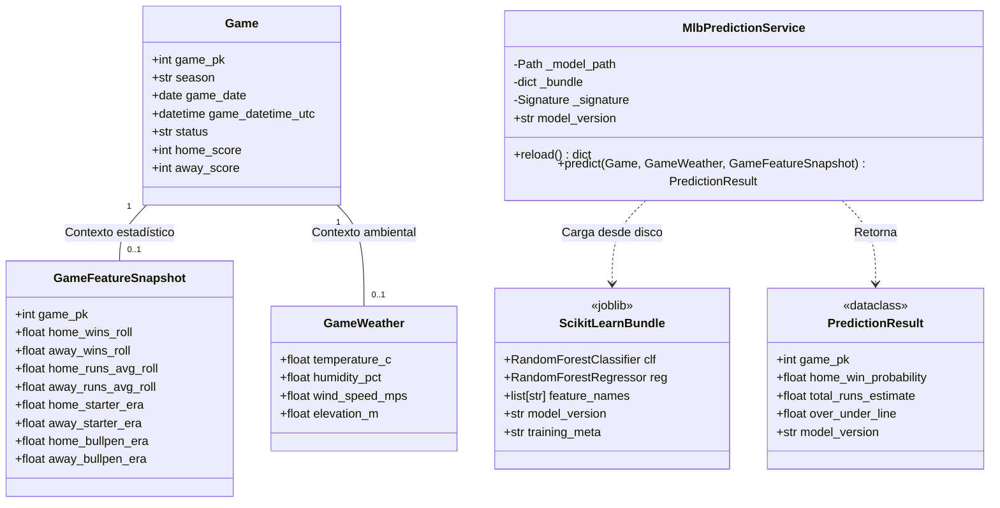
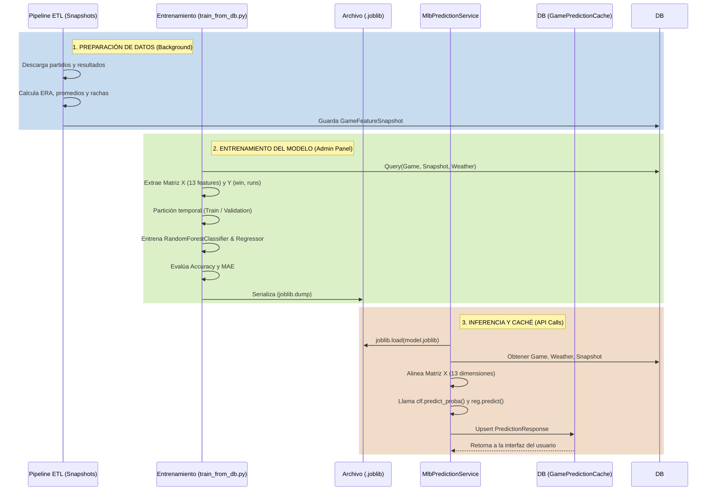

# Visión General del Algoritmo de Predicción (Machine Learning)

El motor de predicciones de la aplicación está construido en Python utilizando **scikit-learn**. Su objetivo principal es estimar dos resultados para cualquier partido de la MLB:
1. **Probabilidad de victoria del equipo local** (`home_win_probability`), utilizando un `RandomForestClassifier`.
2. **Estimación total de carreras** (`total_runs_estimate` y `over_under_line`), utilizando un `RandomForestRegressor`.

El modelo utiliza 13 variables predictoras (features) extraídas de la base de datos (rendimiento reciente de los equipos, efectividad de los lanzadores y condiciones climáticas).

## Diagrama de Clases del Subsistema ML

A continuación se muestra un diagrama de clases que detalla las estructuras de datos, las clases del modelo de dominio y la clase de servicio que encapsula la inferencia de Scikit-Learn.

## Flujo General del Sistema (Macro-Proceso)

Este diagrama grande ilustra el ciclo de vida completo del algoritmo ML en el backend, desde la preparación y el entrenamiento hasta la inferencia y almacenamiento del resultado.

## Detalles Técnicos
- **Variables (Features):** `home_wins_roll`, `away_wins_roll`, `home_runs_avg_roll`, `away_runs_avg_roll`, `temperature_c`, `humidity_pct`, `wind_speed_mps`, `elevation_m`, `home_starter_era`, `away_starter_era`, `home_bullpen_era`, `away_bullpen_era`, y una variable categórica booleana (`defaults_injected`) que permite al Random Forest aprender a ajustar sus ramas cuando hay falta de datos (e.g. sin clima o ERA disponible).
- **Manejo de estados:** Se usa una firma combinada del sistema de archivos (`mtime_ns` y `size`) en el `MlbPredictionService` para realizar una recarga perezosa del modelo en memoria, evitando tiempos de inactividad durante las inferencias y permitiendo que la recarga ocurra "en caliente".
