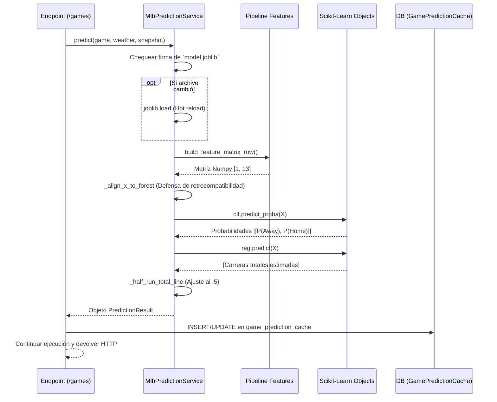

# Fase 2: Inferencia y Caché (Prediction)

La fase de inferencia ocurre cada vez que un usuario hace una solicitud al backend para ver los partidos del día, o cada vez que el sistema detecta un cambio en el partido (por ejemplo, una actualización meteorológica) y solicita recalcular.

## Explicación Técnica

La inferencia es administrada por la clase `MlbPredictionService` de `predictor.py`.

1. **Carga Perezosa (Lazy Loading)**:
   El servicio guarda en memoria el bundle de Scikit-Learn. Antes de hacer una predicción, verifica en el sistema de archivos si la firma del archivo (`mtime_ns` y tamaño en bytes) ha cambiado. Si detecta un cambio (ej. alguien re-entrenó el modelo), hace un hot-reload en memoria.
2. **Transformación de Input**:
   Al recibir una petición de predicción, convierte los modelos `Game`, `GameWeather` y `GameFeatureSnapshot` en un vector de Numpy de dimensión (1x13).
3. **Manejo de Dimensionalidad Antigua**:
   Dado que el modelo pudo haber sido entrenado con 8 o 12 features en el pasado y ahora usa 13, incluye un mecanismo defensivo `_align_x_to_forest` que recorta o inyecta ceros de padding si la matriz y el modelo deserializado no coinciden.
4. **Cálculos**:
   - Para clasificador: `clf.predict_proba(x)[0][1]` obtiene la probabilidad de la clase positiva (Local).
   - Para regresor: `reg.predict(x)[0]` entrega las carreras crudas proyectadas. Luego `_half_run_total_line` asegura que se convierta en una línea decimal tipo apuesta (ej. si estima 8.1, la línea Over/Under es 8.5).
5. **Caché en Base de Datos**:
   El resultado es instanciado como un objeto de Pydantic/DataClass, devuelto al flujo, y el manejador del endpoint lo guarda/upsertea en `game_prediction_cache` asociándolo con el `model_version`. Si el mismo juego se pide después y el cache es del mismo modelo, no vuelve a evaluar.

## Diagrama de Secuencia de la Inferencia

