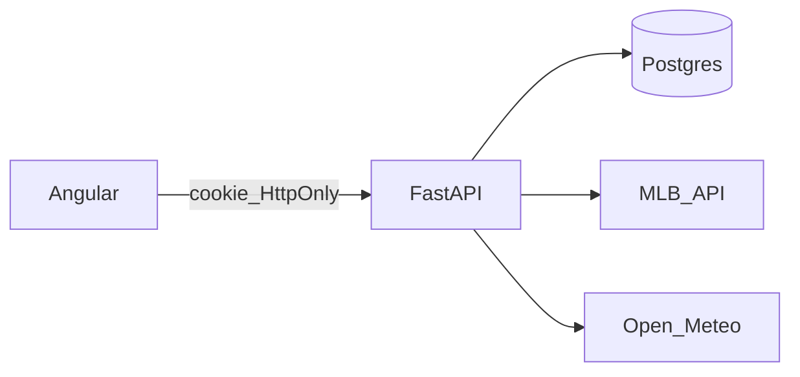

# Informe de auditoría de seguridad — Sports Predictions

**Ámbito:** Backend FastAPI (`Sports-Predictions/backend/src/app/`), frontend Angular (`Sports-Predictions/frontend/src/`), SQL (`Sports-Predictions/backend/sql/`), despliegue típico Render + Vercel + Supabase.

**Metodología:** Revisión estática de código, lectura de configuración, `npm audit --omit=dev`, intento de `pip-audit` (ver sección Dependencias). Las pruebas dinámicas contra producción no se ejecutaron desde CI; ver [SECURITY-TEST-PROCEDURES.md](./SECURITY-TEST-PROCEDURES.md).

**Referencias:** OWASP ASVS v4, OWASP API Security Top 10 (2023).

---

## Resumen ejecutivo

| Severidad | Cantidad (aprox.) |
|-----------|-------------------|
| Critical  | 2 |
| High      | 6 |
| Medium    | 12+ |
| Low       | varios |

**Prioridad inmediata:** secretos en `.env` locales (rotación), CSRF en panel admin con cookie `SameSite=None`, `DEBUG` y fuga vía campo `technical`, rate limiting en login, validación de rutas en `pipeline/train`, superficie de endpoints públicos costosos.

---

## Bloque A — Autenticación y sesión (panel Operaciones)

### Hallazgos

| ID   | Severidad | Hallazgo |
|------|-----------|----------|
| A-1  | Medium    | JWT HS256 solo con `sub`, `iat`, `exp`. Sin `iss`, `aud`, `jti`; no hay revocación en servidor; `logout` solo borra cookie. |
| A-2  | Medium    | `Authorization: Bearer` y cookie aceptadas (`deps_admin.token_from_request`). Bearer desde cliente no-HttpOnly aumenta superficie si se filtra en logs. |
| A-3  | High      | Sin rate limiting ni lockout en `POST /api/v1/admin/auth/login`. |
| A-4  | Low       | Política de contraseña débil: `AdminLoginBody` usa `min_length=1` (`schemas/admin_api.py`). |
| A-5  | Low       | bcrypt con `gensalt()` por defecto (~12 rounds); límite 72 bytes documentado en código. |
| A-6  | Medium    | Comparación de `ADMIN_BOOTSTRAP_SECRET` con `!=` en cadena plana (no `hmac.compare_digest`). |
| A-7  | Info      | Login exitoso no devuelve JWT en JSON; cookie HttpOnly — correcto. |

### Evidencia (código)

- Token: `app/core/admin_security.py` — `jwt.encode(..., algorithm="HS256")`, `jwt.decode(..., algorithms=["HS256"])`.
- Dependencia admin: `app/api/deps_admin.py` — `require_admin_token`, lectura cookie o Bearer.
- Login: `app/api/routes/admin.py` — `_set_admin_session_cookie`, `admin_login`, `admin_bootstrap_first_user`.

### Criterios de aceptación (no cumplidos del todo)

- Brute-force mitigado (429 / captcha / lockout): **no**.
- Mensaje único para usuario inexistente vs contraseña incorrecta: **sí** (ambos 401 genérico salvo 503).
- Cookie con atributos acordes a entorno: configurable vía `ADMIN_COOKIE_*`.

---

## Bloque B — CSRF y mutaciones con cookie

### Hallazgos

| ID   | Severidad | Hallazgo |
|------|-----------|----------|
| B-1  | Critical  | Cookie de sesión admin con `SameSite=None` + `Secure` (cross-site) y **sin** token CSRF, sin `SameSite=strict` en mismo sitio, sin validación de `Origin`/`Referer` en rutas POST admin. Un sitio malicioso puede enviar requests autenticados si el operador tiene sesión activa. |
| B-2  | High      | CORS refleja `Origin` permitido; CSRF no es mitigado por CORS (el navegador **sí envía** la cookie en POST cross-site; la respuesta puede no ser legible por JS atacante, pero la mutación ya ocurrió). |

### Catálogo POST bajo prefijo `/api/v1/admin` (requieren cookie/Bearer)

Autenticados vía `AdminUserDep` donde aplique:

- `/auth/bootstrap`, `/auth/login`, `/auth/refresh`, `/auth/logout` (login/bootstrap públicos o semi-públicos)
- `/pipeline/mlb-daily-snapshot`, `/pipeline/rebuild-snapshots`, `/pipeline/clear-prediction-cache`
- `/predictions/evaluate-pending`, `/predictions/recompute-ml-evaluations`
- `/model/reload`, `/pipeline/train`, `/pipeline/backfill`

### Criterios de aceptación

- Cada POST mutador con sesión cookie protegido contra CSRF: **no cumplido**.

---

## Bloque C — Endpoints públicos abusables (DoS / costo)

### Inventario (sin auth explícita)

| Ruta | Riesgo |
|------|--------|
| `GET /api/v1/games?date=&sync=true` | MLB HTTP + escritura DB + predicción opcional |
| `GET /api/v1/games/{pk}` | DB + predicción |
| `POST /api/v1/games/{pk}/weather` | Open-Meteo + escritura |
| `GET /api/v1/predict/{pk}` | ML + DB |
| `POST /api/v1/predict/{pk}/refresh` | ML + escritura caché |
| `POST /api/v1/mlb/sync-range` | MLB por día (máx. 7 días/request) |
| `POST /api/v1/mlb/games/{pk}/sync` | MLB + DB |
| `GET /api/v1/mlb/history/games` | DB (paginado limit/offset) |

### Hallazgos

| ID   | Severidad | Hallazgo |
|------|-----------|----------|
| C-1  | Medium    | Sin rate limit por IP/cliente en API pública; throttle MLB es **global al proceso** (`mlb_throttle`), no por atacante. |
| C-2  | Medium    | Concurrencia alta en `sync=true` puede saturar DB y cuota MLB. |
| C-3  | Low       | Límites útiles en `mlb/sync-range` (delta máximo 7 días por request, 370 total). |

---

## Bloque D — Secretos, entorno, CORS

### Hallazgos

| ID   | Severidad | Hallazgo |
|------|-----------|----------|
| D-1  | Critical  | Archivos `.env` locales pueden contener `DATABASE_URL` y `ADMIN_JWT_SECRET` reales. Están en `.gitignore`; **rotar credenciales** si el disco o backups son compartidos. No versionar secretos. |
| D-2  | High      | `DEBUG=true` en `.env` local observado: con `DEBUG`, `exception_handlers` incluye `technical` en errores SQL. **Producción debe usar `DEBUG=false`.** |
| D-3  | Medium    | `CORS_ORIGINS` que incluye `http://localhost:4200` junto a dominios productivos amplía orígenes con credenciales si se reutiliza el mismo despliegue. |
| D-4  | Low       | `ADMIN_JWT_SECRET` sin validación de longitud mínima en `config.py` (comentario sugiere ≥16 en prod; no enforced). |
| D-5  | Info      | `git ls-files` no lista `.env` (solo `.env.example`); historial git de `.env` no detectado en comprobación rápida. |

### Supabase / RLS

Las migraciones SQL en repo **no definen** políticas RLS (`grep` sin coincidencias en `backend/sql/`). Si la API usa rol `postgres` o rol con `BYPASSRLS`, RLS es irrelevante salvo endurecimiento explícito — ver Bloque I.

---

## Bloque E — Cabeceras HTTP de seguridad

### Hallazgos

| ID   | Severidad | Hallazgo |
|------|-----------|----------|
| E-1  | Medium    | FastAPI no añade por defecto `Strict-Transport-Security`, `X-Content-Type-Options`, `Referrer-Policy`, `Permissions-Policy` en respuestas JSON. |
| E-2  | Medium    | `frontend/vercel.json` solo define `rewrites`; sin cabeceras de seguridad para el SPA. |
| E-3  | Low       | `index.html` carga fuentes Google sin CSP restrictiva. |

### Baseline recomendado (objetivo)

- API: `X-Content-Type-Options: nosniff`, `Referrer-Policy: no-referrer` o `strict-origin-when-cross-origin`, HSTS si HTTPS terminado en el mismo servicio.
- Front: CSP progresiva, `frame-ancestors 'none'`, HSTS vía plataforma (Vercel).

---

## Bloque F — Inyección, validación, subprocess

### Hallazgos

| ID   | Severidad | Hallazgo |
|------|-----------|----------|
| F-1  | High      | `POST .../pipeline/train`: `subprocess.run` con `body.output` pasado a `--output` sin whitelist de ruta; riesgo de escritura fuera del directorio de artefactos esperado. |
| F-2  | Low       | `mlb_sync.py`: `SET LOCAL statement_timeout = '{sec}s'` con `sec` entero derivado de settings — bajo riesgo si el entero está acotado (lo está). |
| F-3  | Info      | ORM SQLAlchemy usado para consultas principales; no se observó SQL crudo con entrada de usuario sin bind. |

---

## Bloque G — Errores y fuga de información

### Hallazgos

| ID   | Severidad | Hallazgo |
|------|-----------|----------|
| G-1  | High      | Con `DEBUG=true`, respuestas JSON pueden incluir `technical` con detalles de excepción SQL. |
| G-2  | Medium    | `GET /auth/ready` expone si JWT está configurado y si la tabla admin es alcanzable — útil para reconocimiento. |
| G-3  | Low       | Login con servidor sin `ADMIN_JWT_SECRET` → 503 con mensaje que menciona configuración (menos grave que SQL leak). |

---

## Bloque H — Frontend Angular

### Hallazgos

| ID   | Severidad | Hallazgo |
|------|-----------|----------|
| H-1  | Medium    | Ruta `/operations` sin `CanActivate`: cualquiera ve el shell de Operaciones; el daño real está en API, pero UX y superficie de ataques de ingeniería social aumentan. |
| H-2  | Info      | No se encontró `localStorage`/`sessionStorage` para tokens; `AdminApiService` usa cookie HttpOnly + `withCredentials` — alineado con modelo seguro. |
| H-3  | Info      | Sin `bypassSecurityTrustHtml` / `eval` en búsqueda rápida de patrones peligrosos en `src/`. |
| H-4  | Low       | `xlsx` (SheetJS) usado en `backtest-dashboard` para export; ver vulnerabilidades en Bloque K. |
| H-5  | Info      | Build producción: `outputHashing: "all"` en `angular.json`; configuración development con `sourceMap: true` (solo dev). |

---

## Bloque I — Base de datos

### Hallazgos

| ID   | Severidad | Hallazgo |
|------|-----------|----------|
| I-1  | Medium    | Sin políticas RLS en scripts versionados; modelo de amenaza asume API como único cliente con credenciales de BD. |
| I-2  | Info      | `password_hash` VARCHAR(256) suficiente para bcrypt; `username` UNIQUE. |
| I-3  | Low       | Migraciones manuales (`sql/*.sql`) sin herramienta tipo Alembic — riesgo de drift entre entornos. |
| I-4  | Info      | Conexión asyncpg + pooler documentado en `session.py`; TLS depende de URL/host de Supabase. |

---

## Bloque J — Logging y auditoría

### Hallazgos

| ID   | Severidad | Hallazgo |
|------|-----------|----------|
| J-1  | Medium    | No hay tabla ni log estructurado de “quién ejecutó train/backfill/clear-cache”. |
| J-2  | Low       | `admin_bootstrap` y errores usan `log.warning` / `log.error`; falta correlación request-id estándar. |

---

## Bloque K — Dependencias (supply chain)

### npm (`npm audit --omit=dev`)

- **xlsx `*`**: severidad **high** — GHSA-4r6h-8v6p-xvw6 (Prototype Pollution), GHSA-5pgg-2g8v-p4x9 (ReDoS); **No fix available** en el árbol actual. Uso: exportación backtest.

### pip-audit

- Ejecutado con `--cache-dir` local: reportó vulnerabilidad en **pip** (herramienta), CVE-2026-3219; dependencias del proyecto empaquetado como editable pueden no auditarse como paquete PyPI.
- **Recomendación:** `pip-audit -r pyproject.toml` / entorno lockfile (`uv`/`pip-tools`), actualizar `pip`, CI periódico.

---

## Bloque L — Infraestructura

### Hallazgos

| ID   | Severidad | Hallazgo |
|------|-----------|----------|
| L-1  | Medium    | Dockerfile: imagen `python:3.12-slim-bookworm`, proceso por defecto como root; endurecer con usuario no privilegiado. |
| L-2  | Info      | Render/Vercel: HTTPS habitual; verificar “Force HTTPS” y previews protegidos en política de equipo. |
| L-3  | Low       | Rotación de `ADMIN_JWT_SECRET` invalida todas las sesiones; documentar procedimiento en runbook. |

---

## Cumplimiento OWASP API Security Top 10 (2023) — lista de control

Interpretación: **C** cumplido en buena parte, **P** parcial, **N** no / insuficiente.

1. **API1 Broken Object Level Authorization:** **P** — No hay multi-tenant; admin es binario. Objeto-level no aplica igual; endpoints públicos no distinguen usuarios.

2. **API2 Broken Authentication:** **P** — bcrypt + JWT; faltan MFA, rate limit, política de password fuerte, revocación.

3. **API3 Broken Object Property Level Authorization:** **P** — Mass assignment mitigado por Pydantic en rutas revisadas; revisar nuevos endpoints.

4. **API4 Unrestricted Resource Consumption:** **N** — Sin cuotas/rate limits globales; sync y predict consumibles.

5. **API5 Broken Function Level Authorization:** **P** — Admin protegido por dependencia; riesgo CSRF eleva impacto si sesión comprometida.

6. **API6 Unrestricted Access to Sensitive Business Flows:** **P** — Operaciones sensibles requieren admin; CSRF y falta de auditoría debilitan el control.

7. **API7 Server Side Request Forgery:** **C** — URLs MLB/Open-Meteo no controladas por usuario directamente en los paths auditados; revisar cualquier override de URL.

8. **API8 Security Misconfiguration:** **N** — DEBUG, CORS amplio, cabeceras faltantes, Dockerfile root.

9. **API9 Improper Inventory Management:** **P** — OpenAPI `/docs` expone superficie; versions en health.

10. **API10 Unsafe Consumption of APIs:** **P** — Cliente MLB con throttle interno; errores externos manejados genéricamente en parte.

---

## Diagrama de flujo (referencia)

---

*Documento generado como entregable de auditoría; las remediaciones se priorizan en SECURITY-BACKLOG.md.*
