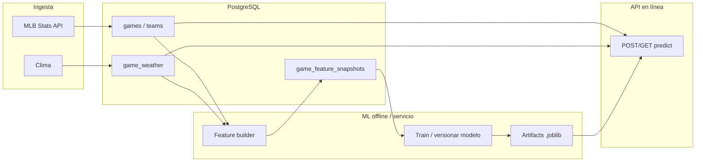

# Diseño del pipeline de cálculo y predicciones (MLB)

Documento de arquitectura: cómo alimentar modelos desde **PostgreSQL** y **APIs públicas** (Stats API de MLB, clima), y cómo evolucionar el sistema respecto al estado actual.

## 1. Objetivo del producto

- **Antes del partido:** estimar probabilidad de victoria del local y carreras esperadas (y derivados útiles para la UI, p. ej. línea tipo O/U).
- **Después del partido:** poder **entrenar y evaluar** modelos con resultados reales guardados en BD.
- **Principio:** la **fuente de verdad operativa** es la BD; las APIs externas son **ingesta** que se normaliza y persiste.

## 2. Fuentes de datos

| Origen | Rol | Persistencia en BD |
|--------|-----|---------------------|
| **MLB Stats API** (pública, vía vuestro cliente) | Calendario, estado, marcador, alineaciones, marcador por entradas | `games`, `teams`, JSON en `lineups_json`, `boxscore_json` |
| **Open-Meteo** (u otro proveedor) | Condiciones en el estadio | `game_weather` |
| **Cálculo interno** | Vectores de features y etiquetas para ML | `game_feature_snapshots` (ya definido en el modelo) |

Nada de esto debe “contaminar” la UI con nombres técnicos de parámetros o IDs internos; el contrato hacia el frontend sigue siendo el de `/api/v1`.

## 3. Estado actual (resumen honesto, 2026-05-07)

- **Ingesta MLB y clima:** ✅ encajan en el flujo de sincronización y rutas de juegos. ETL diario opt-in (`MLB_DAILY_SNAPSHOT_ENABLED=true`).
- **Inferencia:** ✅ `GET /api/v1/predict/{game_pk}` carga el `Game` (+ `weather` + `GameFeatureSnapshot`) desde la BD y llama a `MlbPredictionService.predict`. Existe además `POST /predict/{pk}/refresh` para forzar recálculo y caché versionada (`prediction_results.model_version`).
- **Features:** ✅ `build_feature_matrix_row` lee de `game_feature_snapshots` cuando existe (rolling wins/runs, ERA abridor, ERA staff, clima). Si falta el snapshot o partes, **inyecta defaults** y marca el flag `defaults_injected = 1` en la última columna del vector. La cola del MVP-1 (ver §11) es subir la cobertura de snapshots para días futuros (`UPCOMING_SNAPSHOT_DAYS`).
- **Entrenamiento:** ✅ `app.ml.train_from_db` entrena RF contra `game_feature_snapshots` con etiquetas reales (`home_win`, `total_runs`), partición temporal (`--val-from` o 80/20 por fecha), métricas de validación (accuracy, MAE, std de probabilidad) y `training_meta` embebido en el bundle. `training.py::train_default_model` queda solo como fallback de desarrollo (`ML_AUTO_SYNTHETIC_ON_MISSING`).

El **tubo API → modelo → respuesta → evaluación → backtest** está completo. Lo que queda para cerrar MVP-1:

- Identificar el modelo activo desde la app pública (PR2): tabla `model_versions`, endpoint `GET /api/v1/model/info`, banner UI.
- Mejorar cobertura de snapshots para `week`.
- Tests de admin/auth/scheduler (PR3).

## 4. Pipeline objetivo (alto nivel)

### 4.1 Etapa A — Enriquecer features desde la BD ✅ implementado

Objetivo: sustituir placeholders por señal real **calculable solo con datos que ya guardáis** (o que podáis derivar con consultas SQL).

Ejemplos de señales típicas (priorizar según datos disponibles):

- Forma reciente: victorias en ventana N partidos **por equipo** antes de `game_date`.
- Ofensiva/defensiva reciente: medias de carreras anotadas/permitidas en ventana N.
- Home/away: splits locales vs visitante si hay historial suficiente.
- Pitcher/bullpen: **solo** si en el futuro parseáis lineups o boxscore a estructura utilizable (hoy el JSON crudo está en BD pero no en features).

Implementación sugerida:

1. Servicio **batch** (job o endpoint admin) que, para un rango de fechas o `game_pk`, calcule filas y haga **upsert** en `game_feature_snapshots` (incl. `feature_vector_json` o columnas numéricas ya acordadas con `FEATURE_NAMES`).
2. `build_feature_matrix_row` pasa a **leer primero el snapshot**; si no existe, opcionalmente calcula al vuelo o devuelve error controlado / fallback documentado.

### 4.2 Etapa B — Etiquetas (supervisión) ✅ implementado

Para entrenar clasificación (¿gana local?) y regresión (carreras totales):

- Tras partidos **finalizados**, `home_win` y `total_runs` en `game_feature_snapshots` (o tabla de training) se rellenan desde `home_score`, `away_score` en `games`.

Esto amarra el ML a **la misma BD** que alimenta el historial en la app.

### 4.3 Etapa C — Entrenamiento versionado ✅ implementado (parcial)

- ✅ Comando `python -m app.ml.train_from_db` que:
  - Lee filas con features + etiquetas no nulas.
  - Particiona por tiempo (`--val-from` o 80/20 temporal) para evitar fugas.
  - Guarda joblib con manifiesto (`training_meta` JSON con `feature_names`, `trained_on_games`, `val_from_requested`, `split_mode`, `metrics`).
- ✅ Variable `ML_MODEL_PATH` apunta al artifact activo (`resolve_model_path`).
- ✅ Versión expuesta como `<base>@<mtime_ns_hex>` para distinguir archivos.
- 🟡 **Pendiente PR2**: tabla `model_versions` con historial (fecha de carga, métricas, autor) para tener trazabilidad cross-deploy y rollback consciente.
- 🟡 **Pendiente** (decisión): umbral mínimo de calidad antes de promover (val_accuracy, std de proba) — hoy se loguea pero no bloquea.

### 4.4 Etapa D — Servir predicciones ✅ implementado

- ✅ `GET /predict/{game_pk}` como entrada principal del frontend.
- ✅ Tabla `prediction_results` (`game_pk` PK, `home_win_probability`, `total_runs_estimate`, `over_under_line`, `model_version`, `trigger_reason`, `computed_at`, + campos de evaluación). Se invalida al sincronizar el partido (`refresh_prediction_cache_for_games` en `BackgroundTasks`) y al recargar modelo.
- ✅ Evaluación automática: `predicted_winner`, `actual_winner`, `is_correct`, `evaluated_at` se llenan tras el sync de partidos finales.

## 5. Contrato con el frontend

- No hace falta exponer el vector de features ni el nombre del archivo del modelo.
- `model_version` en la respuesta puede ser un **identificador de producto** (p. ej. `rf-2025-04-v3`) en lugar de un string opaco, si queréis trazabilidad sin jerga.

### 5.1 Inferencia «eager» (push) y disparo manual

- **Automático:** cuando exista el worker tras sincronización o cambio de contexto (alineaciones, clima, etc.), la estimación se precalcula y se guarda en caché (`prediction_results` u homónimo) para que `GET /predict/{game_pk}` sea lectura rápida.
- **Manual (resiliencia):** `POST /api/v1/predict/{game_pk}/refresh` recalcula con los datos **ya persistidos** en BD (misma forma de respuesta que el GET). Sirve si un proceso en segundo plano falló o el usuario quiere forzar un nuevo cálculo sin volver a descargar el partido entero.
- **UI:** en detalle de partido, una franja discreta bajo la navegación explica que la estimación suele actualizarse sola y ofrece el botón secundario «Actualizar estimación» (copy sin términos técnicos; no compite visualmente con «Actualizar datos»).

## 6. Orden de implementación recomendado (estado real)

1. ✅ Job de **backfill** de `game_feature_snapshots` con rolling stats — `app.cli.backfill_history` + `app.cli.rebuild_feature_snapshots`.
2. ✅ `build_feature_matrix_row` usa snapshots; flag `defaults_injected` señala filas con imputación.
3. ✅ Pipeline de **training** leyendo de BD (`train_from_db`); el dataset sintético queda como fallback de desarrollo.
4. ✅ **Batch predict / cache** para el listado del día (`prediction_results` + `refresh_prediction_cache_for_games`).
5. ✅ Señales de pitching reales (ERA abridor + ERA staff) vía `pitching_stats` + `pitching_era_cache`.
6. 🟡 Cobertura de snapshots para días futuros (`UPCOMING_SNAPSHOT_DAYS`) — pendiente, ver [pendientes.md](pendientes.md).
7. 🟡 Trazabilidad de modelos (`model_versions`) — PR2.

## 7. Riesgos y límites

- **Calidad de datos:** predicciones solo serán tan buenas como la sincronización MLB + completitud de marcadores en histórico.
- **Sesgo temporal:** mezclar temporadas sin normalizar puede sesgar; conviene features relativas o estandarización por liga/temporada.
- **Coste de cómputo:** ventanas rodantes por equipo implican consultas agregadas; indexar por `game_date`, `home_team_id`, `away_team_id`.

Este documento es la referencia para alinear backend, datos y evolución del modelo sin romper el contrato actual del API.

## 8 Estrategia de Gestión de Datos (Mantenimiento y Limpieza)
Para evitar que la base de datos se vuelva inmanejable y lenta, implementaremos un ciclo de vida de datos estacional.

4.1 Particionamiento y Backups
Tablas por Temporada: Si usas PostgreSQL, puedes usar Table Partitioning por rango de fechas. Al terminar la temporada, la partición "2025" se puede exportar a un archivo .sql o .csv y guardarse en AWS S3.

Cold Storage: Los JSON pesados de boxscore_json y lineups_json son los que más pesan. Una vez procesados en game_feature_snapshots, pueden borrarse de la BD operativa tras 30 días del fin de temporada.

4.2 Script de "Limpieza de Primavera" (Spring Cleaning)
Un comando de CLI (python manage.py db-purge --season 2025) que realice:

Export: Genera un dump de seguridad.

Aggregated Summary: Guarda solo los promedios finales de jugadores/equipos en una tabla de historical_stats (mucho más ligera) para que los modelos futuros tengan contexto histórico sin necesidad de los miles de filas de juegos individuales.

Truncate: Elimina filas de games, game_weather y snapshots de la temporada vieja.

## COSIDERACIONES
Abstracción del "Sport Engine"
Para evitar que el código sea un espagueti de if sport == 'mlb', el diseño debe basarse en adaptadores.

Capa de Ingesta: Un normalizador que convierta cualquier API (MLB Stats, API-Football, etc.) a un formato estándar de Match / Event.

Feature Registry: En lugar de una tabla gigante, cada deporte tiene su propia lógica de "Snapshots" pero comparten la misma estructura de tabla game_feature_snapshots usando una columna sport_type.

### Deep Dive: Señales Críticas por Deporte
El modelo debe ser capaz de procesar variables de alta sensibilidad que cambian según el deporte:DeporteSeñal de Oro (Alta Prioridad)Variable de EntornoMLBStarting Pitcher (SP): ERA, K/9, historial vs equipo.Park Factor y Viento (Homeruns).FútbolAlineación y Estilo: Posesión media, centros (Córners), agresividad (Tarjetas).Estado del césped / Altitud.NBALoad Management: Bajas de último minuto (Stars), eficiencia ofensiva.Descanso (Back-to-back games).

