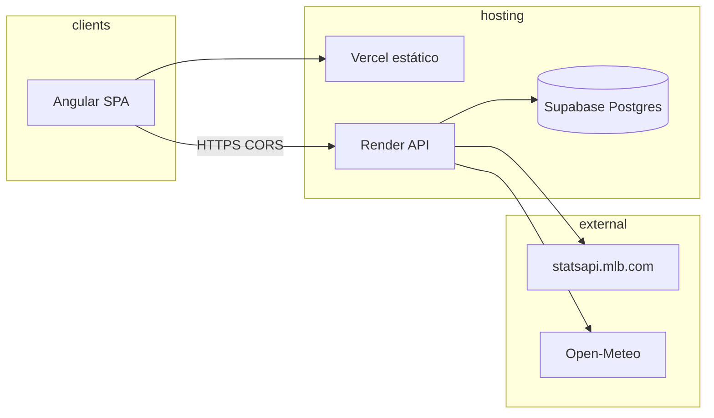

# Estado actual — Sports-Predictions

**Última actualización:** 7 de mayo de 2026.

**Relacionado:** visión y resumen ejecutivo en [vision-y-alcance.md](vision-y-alcance.md) · auditoría de gaps en [estado-real-mvp1.md](estado-real-mvp1.md) · índice de docs en [README.md](README.md).

---

## 1. Descripción del proyecto

**Sports-Predictions** es un monorepo **backend (FastAPI) + frontend (Angular)** que ofrece:

- **Datos MLB** persistidos en PostgreSQL (partidos, equipos, marcadores, JSON de box score, alineaciones, abridores, ERAs por temporada).
- **Clima** en el estadio vía **Open-Meteo** y coordenadas por `venue_id`.
- **Predicciones** con un modelo **Random Forest** (`joblib`) entrenado contra los snapshots de la BD; expuestas por API y mostradas en la app con badges de acierto/fallo.
- **Operaciones** privadas (`/operations`): backfill, rebuild snapshots, train, reload, ETL diario, métricas y backtest.

El MVP-1 se centra en MLB; la estructura permite añadir otros deportes en MVP-2.

---

## 2. Contexto completo (cómo encaja todo)

- **Usuario** abre el front (Vercel o `localhost:4200`); el front llama al **API** (Render o `localhost:8000`).
- El **API** lee/escribe **Postgres** (Supabase con **transaction pooler** en free tier) y, según el endpoint, llama a **MLB** y **Open-Meteo**.
- **Dos formas de "sincronizar":**
  - **HTTP en línea**: rangos cortos (≤ 7 días) bloquean la petición; el frontend trocea por días.
  - **Background tasks** del API: `POST /admin/pipeline/backfill` corre en `BackgroundTasks`, persiste estado en memoria (`app.state.backfill_job`) y se sigue desde `GET /admin/pipeline/backfill-status`.
- **Job ETL diario en proceso**: `daily_snapshot_loop_forever` (opcional, vía `MLB_DAILY_SNAPSHOT_ENABLED=true`) sincroniza hoy+mañana UTC y recalcula `game_feature_snapshots` de la temporada actual.

---

## 3. Qué hay implementado (detalle)

### 3.1 Backend (`backend/src/app/`)

| Área | Implementación |
|------|----------------|
| **App** | `FastAPI`, lifespan con `httpx.AsyncClient`, servicio de predicción en `app.state`, tarea ETL diaria opcional |
| **Routers** | `health`, `games`, `mlb`, `predict`, `admin` (todos con prefijo `/api/v1` salvo `/health`) |
| **Config** | Variables tipadas con Pydantic; `DATABASE_URL` normalizada a `postgresql+asyncpg`; rate-limit y throttling configurable |
| **Sesión DB** | `NullPool` + ajustes para PgBouncer / pooler; commit al final de cada request vía `get_db` |
| **Auth admin** | JWT HS256 firmado en backend, cookie HttpOnly, rate-limit por IP en login, refresh automático del front durante operaciones largas, CSRF guard via `X-Requested-With` para mutaciones con cookie |
| **MLB cliente** | `schedule`, `schedule_for_game`, `boxscore`, `live_feed`, `linescore` |
| **MLB sync** | `sync_games_for_date`, `sync_single_game`, `upsert_team`, `lineups_from_boxscore`, `starters_from_boxscore` |
| **Clima** | `upsert_weather_for_game` (Open-Meteo + `mlb_stadiums.json`) |
| **Features** | `feature_snapshots.py` recalcula rolling stats globales; `pitching_stats.py` consulta y cachea ERA por jugador y por equipo |
| **ML** | `train_from_db.py` (real) + `training.py` (sintético, fallback). `predictor.py` con versión `<base>@<mtime_ns>` |
| **Caché de predicciones** | `prediction_cache.py` + tabla `prediction_results`; evaluación automática tras sync de partidos finales; `recompute-ml-evaluations` para reevaluar tras cambios de lógica |
| **Backtest** | `services/backtest.py` resuelve ML+O/U con summary, timeseries y filas, expuesto en `/admin/predictions/backtest` |

### 3.2 Endpoints (referencia)

#### Públicos

| Método | Ruta | Rol |
|--------|------|-----|
| GET | `/` | Metadatos del servicio (incluye `model_loaded`, `active_model_version`) |
| GET | `/health` | Liveness simple |
| GET | `/api/v1/games?date=YYYY-MM-DD&sync&fetch_details&include_predictions` | Lista del día con metadata (`warnings`, `info`, `missing_snapshot_count`) |
| GET | `/api/v1/games/{game_pk}?include_predictions` | Detalle |
| POST | `/api/v1/games/{game_pk}/weather` | Refrescar clima |
| GET | `/api/v1/mlb/teams` | Equipos |
| GET | `/api/v1/mlb/history/games` | Historial con filtros (season, team_id, from, to, only_final, only_with_scores, limit, offset) |
| GET | `/api/v1/mlb/history/games/{game_pk}` | Un partido |
| POST | `/api/v1/mlb/sync-range` | Sincronizar rango (**máx. 7 días por petición** + tope absoluto 370) |
| POST | `/api/v1/mlb/games/{game_pk}/sync` | Sincronizar **un** partido; body `{ "fetch_details": bool }` |
| GET | `/api/v1/predict/{game_pk}` | Predicción (sirve caché si `model_version` coincide) |
| POST | `/api/v1/predict/{game_pk}/refresh` | Recalcula y actualiza caché |
| GET | `/api/v1/model/info` | **Información mínima del modelo activo (público)**: `model_version`, `base_version`, `is_synthetic`, `loaded_at`. Sin métricas detalladas. |

#### Admin (`/api/v1/admin/*`, requieren cookie `sp_admin_access` con JWT válido)

| Método | Ruta | Rol |
|--------|------|-----|
| GET | `/admin/auth/ready` | Pre-check: ¿hay JWT secret y tabla `admin_users`? |
| POST | `/admin/auth/bootstrap` | **Una sola vez**: primer operador (header `X-Admin-Bootstrap-Secret`) |
| POST | `/admin/auth/login` | Devuelve cookie HttpOnly + perfil; rate-limit por IP |
| POST | `/admin/auth/refresh` | Renueva el JWT (mismo TTL) durante tareas largas |
| POST | `/admin/auth/logout` | Borra la cookie |
| GET | `/admin/auth/me` | Sesión actual (TTL restante) |
| GET | `/admin/status` | Estado del modelo (archivo en disco, cargado, versión activa) |
| GET | `/admin/model/versions` | Histórico paginado de modelos cargados con métricas (`val_accuracy_home`, `val_mae_total_runs`, `val_proba_home_std`), `loaded_by`, `is_active`. |
| POST | `/admin/pipeline/mlb-daily-snapshot` | Bajo demanda: igual que el job programado |
| POST | `/admin/pipeline/rebuild-snapshots` | Recalcula `game_feature_snapshots` |
| POST | `/admin/pipeline/clear-prediction-cache` | Vacía la caché de predicciones |
| POST | `/admin/pipeline/backfill` | Importación por fechas en segundo plano (BackgroundTasks) |
| GET | `/admin/pipeline/backfill-status` | Estado del último job |
| POST | `/admin/pipeline/train` | Lanza `python -m app.ml.train_from_db` como subproceso (timeout 900s) |
| POST | `/admin/model/reload` | Recarga el `joblib` activo en memoria |
| POST | `/admin/predictions/evaluate-pending` | Evalúa predicciones con partido finalizado pero sin evaluar |
| POST | `/admin/predictions/recompute-ml-evaluations` | Reevalúa todas las filas con marcador (alinea ML con probabilidad) |
| GET | `/admin/predictions/metrics` | Totales y accuracy global de la caché |
| GET | `/admin/predictions/evaluations` | Lista paginada de predicciones evaluadas |
| GET | `/admin/predictions/backtest` | Resumen + serie diaria + filas ML+O/U para el dashboard |

Documentación interactiva: `GET {BASE_URL}/docs` (Swagger generado por FastAPI).

### 3.3 Base de datos

- DDL en `backend/sql/`. Migraciones aplicadas manualmente (sin Alembic). Detalle por archivo en [migraciones.md](migraciones.md) y [`backend/sql/README.md`](../backend/sql/README.md).
- Resumen rápido del esquema (referencia humana en [`backend/sql/schema.txt`](../backend/sql/schema.txt)):

| Tabla | Rol |
|-------|-----|
| `teams` | Equipos MLB (id = id de statsapi). |
| `games` | Partidos. Incluye marcadores, JSON de box score / lineups, abridores. |
| `game_weather` | Clima por partido (Open-Meteo). |
| `game_feature_snapshots` | Vector de features para entrenamiento e inferencia. |
| `pitching_era_cache` | Caché de ERA (jugador o staff) por temporada. |
| `prediction_results` | Caché de predicciones + evaluación contra resultado real. |
| `admin_users` | Operadores del panel `/operations` (bcrypt). |
| `model_versions` | Historial de modelos cargados (versión, base, métricas, `is_active` único). |

### 3.4 Frontend (`frontend/src/app/`)

| Pantalla / módulo | Contenido |
|-------------------|-----------|
| `mlb/today`, `mlb/tomorrow`, `mlb/week` | Listados con `signals`/`computed`, caché por rango, badges Hit/Miss |
| `mlb/history` | Filtros + listado + sync por rango (1 día por petición) + enlace a detalle |
| `mlb/game/:gamePk` | Marcador, clima, predicción, **box score** (R/H/E + innings) + JSON, alineaciones (live o boxscore), botones «Actualizar clima» y «Actualizar desde MLB» |
| `operations` | Tabs **Dashboard** (`backtest-dashboard`) y **Sincronización y modelos** (login JWT + ETL + train + reload). Polling de progreso del backfill, diálogos de resultado |
| `soccer`, `nba` | `coming-soon` (UI placeholder para MVP-2) |
| Servicios | `games-api.service.ts` (caché RxJS + TTL), `admin-api.service.ts` (auth + ETL), `request-cache.ts` |
| Entornos | `environment.ts` / `environment.prod.ts` (`apiUrl`) |

**Build de producción:** `npm run build` → artefactos en `frontend/dist/browser` (Vercel: **Output Directory** `dist/browser`).

### 3.5 Tests

`pytest` con `pytest-asyncio` en `backend/tests/`. Cubierto: salud, parse MLB, sync MLB, predictor (recarga al cambiar archivo), feature snapshots, prediction cache (helper), backtest, configuración y URL de BD. **No cubierto** (en backlog): routes admin, auth/JWT, scheduler diario, `train_from_db`. Frontend: solo `app.component.spec.ts` por ahora.

### 3.6 Despliegue y documentación operativa

- [deploy.md](deploy.md) — Supabase, Render, Vercel, CORS.
- [errores_direct_connection.md](errores_direct_connection.md) — pooler e IPv4.
- [migraciones.md](migraciones.md) — orden de aplicación SQL y troubleshooting.

---

## 4. Sincronización MLB (comportamiento acordado)

- **`fetch_details=true`:** schedule + por partido box score, live feed (cuando aplica) y linescore. Alineaciones desde live; si no hay (típico finalizado), desde boxscore (`source: "boxscore"`).
- **Rango ≤ 7 días en una petición**: el backend lo rechaza con 400; el frontend trocea por día. Tope absoluto 370 días.
- **Un partido**: `POST /mlb/games/{game_pk}/sync` (botón «Actualizar desde MLB»).
- **Backfill largo**: `POST /admin/pipeline/backfill` en segundo plano con tracking. Estado consultable y dialogue final con éxito/error.
- **Diario opt-in**: `MLB_DAILY_SNAPSHOT_ENABLED=true` arranca un loop dentro del proceso del API (`asyncio.create_task` en lifespan). Importa hoy+mañana UTC y recalcula snapshots. Usar también desde el panel cuando el proceso reinicie y se haya perdido la ventana.

Más detalle e histórico: [pendientes-sync-boxscore.md](pendientes-sync-boxscore.md).

---

## 5. APIs externas y claves

| Fuente | Uso | API key |
|--------|-----|---------|
| `statsapi.mlb.com` | Partidos, box score, line score, *live*, ERA jugador/staff | No |
| Open-Meteo | Clima en coordenadas del estadio | No |
| Supabase (Postgres) | Persistencia | Cadena de conexión en `DATABASE_URL` |
| API-Sports, etc. | No integrado en MVP-1 | — |

---

## 6. Limitaciones conocidas (no bloquean pruebas locales)

- **`UPCOMING_SNAPSHOT_DAYS = 1`** → la vista `week` muestra partidos a 3-7 días sin features → P(home) plana. Aviso: en `meta.warnings` del API y en logs.
- **Identificación del modelo activo: ✅ PR2 implementado.** Tabla `model_versions` (`is_active` único), endpoint público `GET /api/v1/model/info`, footer en la app pública, banner amarillo en `/operations` cuando el modelo es sintético, backup automático del joblib previo al entrenamiento.
- **Sin cron externo**: si el proceso del API se reinicia o duerme, el ETL diario no se ejecuta. Lanzarlo bajo demanda desde Operaciones.
- **Sin re-entrenamiento programado**: requiere acción humana. Decisión de producto en [pendientes.md](pendientes.md).

---

## 7. Checklist para probar en local

1. PostgreSQL o Supabase con tablas creadas: ejecutar **en orden** los archivos `backend/sql/00*.sql` (ver [migraciones.md](migraciones.md)).
2. `backend/.env` desde `.env.example`: `DATABASE_URL`, `CORS_ORIGINS`, `ADMIN_JWT_SECRET` (panel admin), `ADMIN_BOOTSTRAP_SECRET` opcional para crear el primer operador.
3. `frontend` con `apiUrl` apuntando al backend.
4. Arrancar API (`uvicorn app.main:app --reload --app-dir src`) y Angular (`ng serve` o `npm start`).
5. Abrir `http://localhost:4200/operations`, iniciar sesión, hacer un backfill corto, **Recalcular indicadores**, **Entrenar**, **Recargar modelo**.

---

## 8. Estructura del repositorio

| Ruta | Contenido |
|------|-----------|
| `backend/` | API, `sql/`, tests, `Dockerfile` |
| `backend/src/app/api/routes/` | Routers HTTP (health, games, mlb, predict, admin) |
| `backend/src/app/services/` | Lógica de dominio (mlb_sync, feature_snapshots, prediction_cache, backtest, etc.) |
| `backend/src/app/ml/` | Predictor, training, train_from_db, features |
| `backend/src/app/cli/` | `create_admin`, `backfill_history`, `rebuild_feature_snapshots` |
| `frontend/` | Angular, `vercel.json`, `dist/browser` al construir |
| `docs/` | Esta documentación (ver [README.md](README.md)) |

Reglas y estilo compartidos del repo padre: `../../docs/` (no duplicar aquí; enlazar).
