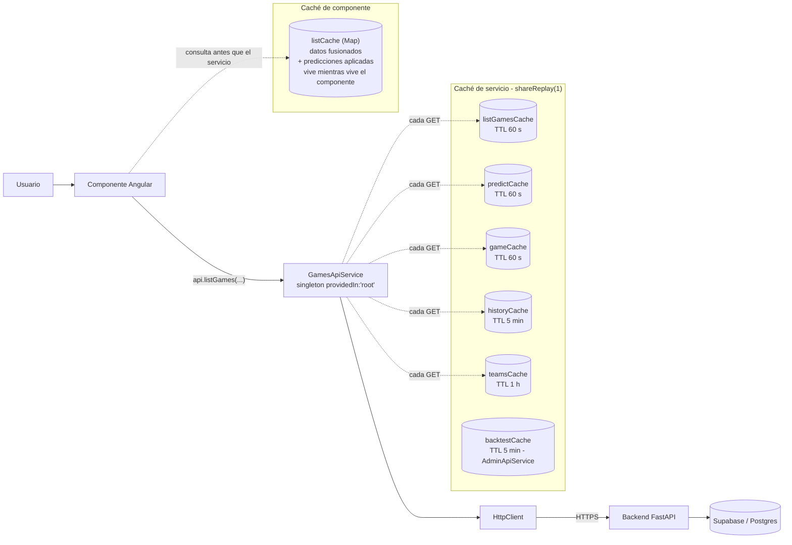
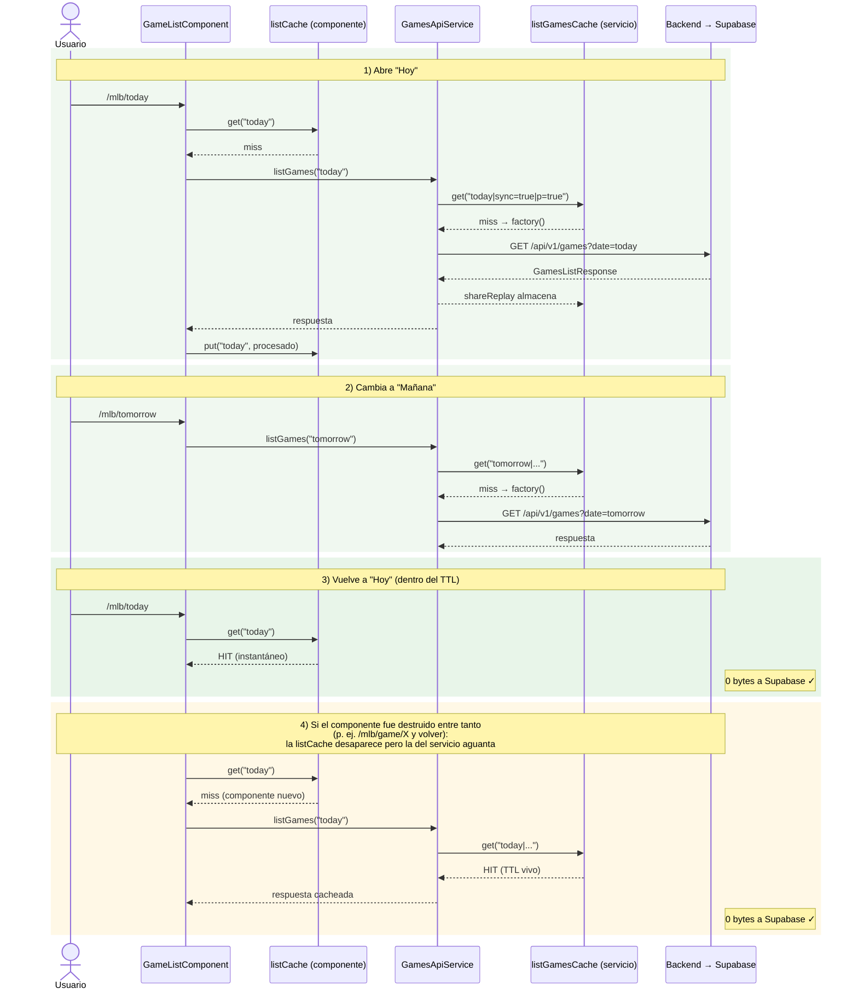
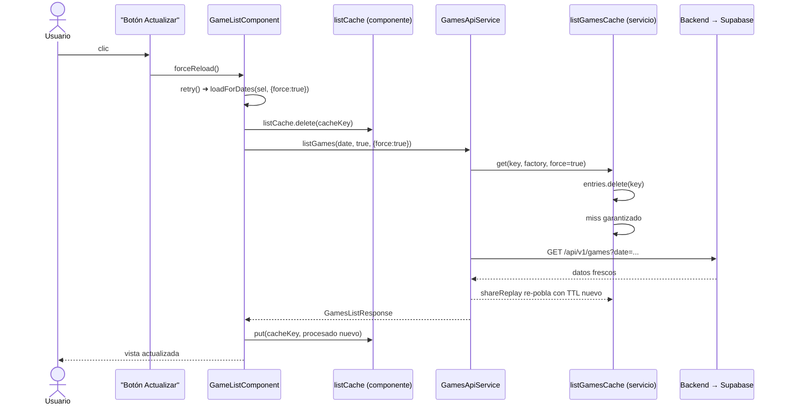
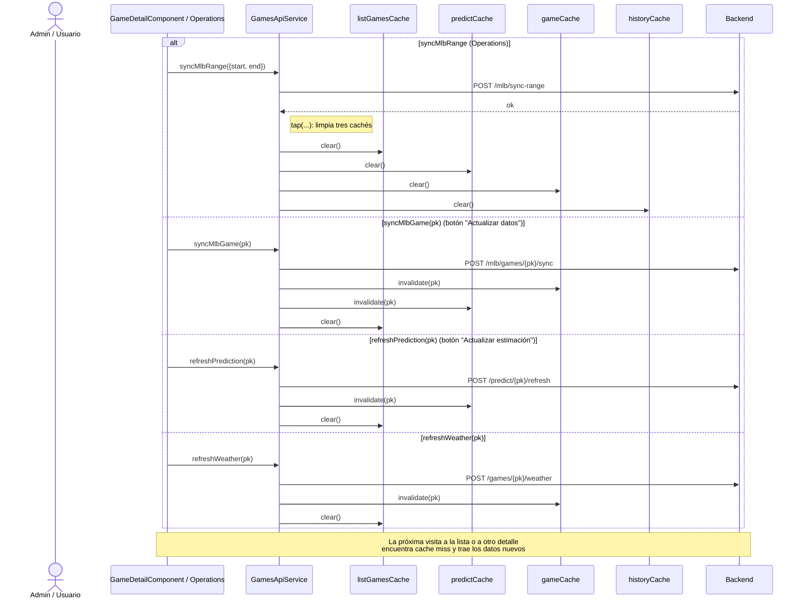
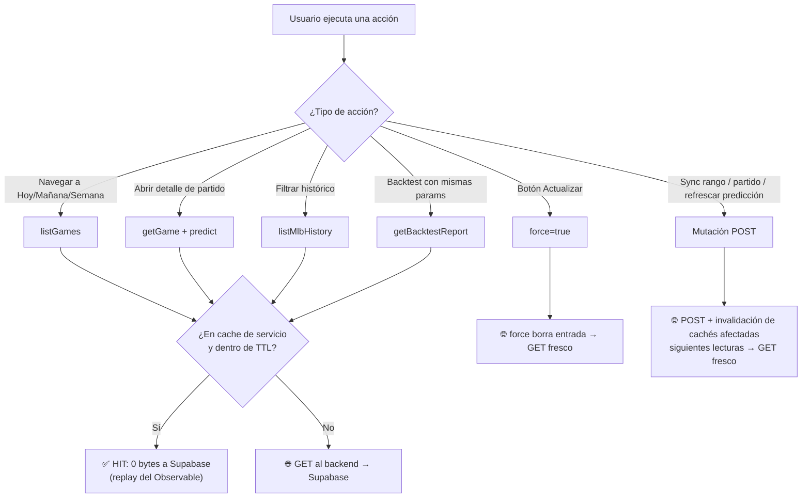

# Caché HTTP en el frontend (Angular + RxJS)

> Estado: implementado en abril 2026. Ámbito: SPA Angular `frontend/`.
> Documento hermano (memoización dentro de componentes con `signal`/`computed`):
> [../../docs/ANGULAR-MEMOIZATION-GUIDE.md](../../docs/ANGULAR-MEMOIZATION-GUIDE.md).

## Objetivo

Reducir el **egress de Supabase** y la latencia percibida cuando el usuario alterna
entre vistas que pegan a los mismos datos (Hoy / Mañana / Semana, detalles de partido,
backtest). La idea: que la primera petición de cada combinación de parámetros se
comparta entre suscriptores y se replique sin nueva HTTP mientras siga siendo «fresca».

## Diseño en dos capas

1. **Caché de componente** — `Map<cacheKey, GamesListCacheEntry>` dentro de
   `GameListComponent`. Guarda el resultado **post-procesado** (juegos fusionados,
   meta consolidada, mapa de probabilidades). Vive mientras viva la instancia del
   componente; muere al navegar a otra ruta que destruya el componente.
2. **Caché de servicio** — `RequestCache<T>` con `shareReplay(1)` y TTL en
   `GamesApiService` y `AdminApiService`. Vive durante toda la sesión (services
   `providedIn: 'root'`). Sobrevive al cambio de ruta y a la destrucción del
   componente.



## Flujo Hoy → Mañana → Hoy (caso feliz: 0 bytes en el regreso)



## Decisión interna de `RequestCache.get(key, factory, force)`

`frontend/src/app/services/request-cache.ts` implementa la utilidad reutilizable.
`shareReplay({ bufferSize: 1, refCount: false })` garantiza que peticiones
concurrentes con la misma clave compartan **una sola** HTTP. Los errores no se
cachean: la entrada se elimina al primer fallo y el siguiente subscriber lanza
una petición nueva.

```mermaid
flowchart TD
  Start["get(key, factory, force=false)"] --> Q1{force === true?}
  Q1 -->|sí| Del["entries.delete(key)"]
  Q1 -->|no| Q2
  Del --> Q2{entries.has(key)?}
  Q2 -->|no| Make
  Q2 -->|sí| Q3{"now − createdAt < ttlMs?"}
  Q3 -->|sí| Hit["return entry.observable<br/>(replay del último valor)"]
  Q3 -->|no| Make["factory().pipe(shareReplay(1))"]
  Make --> Save["entries.set(key, entry)"]
  Save --> Wrap["pipe(catchError → entries.delete(key))<br/>los errores no se cachean"]
  Wrap --> Out[return observable]
  Hit --> Out
```

## Botón «Actualizar» (force refresh desde la UI)

Disponible en:

- `GameListComponent` (Hoy/Mañana/Semana): header de la página → `forceReload()`.
- `MlbHistoryComponent`: toolbar al lado de «Filtros» → `forceReload()`.
- `BacktestDashboardComponent`: botón «Actualizar» → `refresh()`.

> Diferencia con los botones existentes en el detalle de partido y en operaciones:
> «Actualizar datos» (`GameDetailComponent`) y «Actualizar rango»
> (`MlbHistoryComponent`) son **mutaciones del backend** (descargan de la API de
> MLB y reescriben en BD). El botón «Actualizar» nuevo solo **vuelve a leer del
> backend** ignorando la caché del cliente; no toca MLB ni reescribe nada.



## Mutaciones invalidan caché automáticamente

Cualquier acción que pueda hacer **stale** los datos cacheados (sync con MLB,
recálculo de predicción, refresco de clima) invalida las entradas afectadas en
`tap(...)` dentro del propio servicio. Al volver el usuario a la lista o al
detalle, el `RequestCache.get` encuentra cache miss y trae los datos nuevos.



> En `AdminApiService`, las mutaciones que pueden cambiar el modelo o los
> snapshots (`trainModel`, `rebuildSnapshots`, `clearPredictionCache`,
> `reloadModel`, `logout`) limpian `backtestCache`.

## Resumen visual: ¿cuándo viaja un byte a Supabase?



## Tabla de TTL por endpoint

| Servicio / método | Caché | TTL | Invalidación automática |
|---|---|---|---|
| `GamesApiService.listGames(date, sync, {force})` | `listGamesCache` | 60 s | `syncMlbRange`, `syncMlbGame`, `refreshWeather`, `refreshPrediction` |
| `GamesApiService.getGame(pk, {force})` | `gameCache` | 60 s | `syncMlbGame`, `refreshWeather` (por pk) |
| `GamesApiService.predict(pk, {force})` | `predictCache` | 60 s | `syncMlbGame`, `refreshPrediction` (por pk) |
| `GamesApiService.listMlbTeams({force})` | `teamsCache` | 1 h | — |
| `GamesApiService.listMlbHistory(params, {force})` | `historyCache` | 5 min | `syncMlbRange` |
| `AdminApiService.getBacktestReport(params, {force})` | `backtestCache` | 5 min | `trainModel`, `rebuildSnapshots`, `clearPredictionCache`, `reloadModel`, `logout` |

## Archivos relevantes

- `frontend/src/app/services/request-cache.ts` — utilidad genérica con TTL + `shareReplay(1)`.
- `frontend/src/app/services/games-api.service.ts` — caché por endpoint + `tap` de invalidación.
- `frontend/src/app/services/admin-api.service.ts` — `backtestCache`.
- `frontend/src/app/game-list/game-list.component.ts` — `forceReload()` reusa `retry()` con `force: true`.
- `frontend/src/app/mlb-history/mlb-history.component.ts` — `forceReload()` → `load({ force: true })`.
- `frontend/src/app/backtest-dashboard/backtest-dashboard.component.ts` — `refresh()` → `load({ force: true })`.

## Cuándo NO usar el cache (decisiones tomadas)

- `AdminApiService.getBackfillStatus()`: lo poll cada 2 s durante un backfill;
  cachear no aporta y enmascararía el progreso.
- `AdminApiService.status()`: estado general del API; pequeño y se pide
  manualmente al pulsar «Refrescar estado».
- `AdminApiService.authReady()`, `checkSession()`, `login()`, `logout()`,
  `refreshSession()`: lifecycle de sesión; el estado se mantiene en
  `sessionOk` dentro del propio servicio.
- Mutaciones (`POST`/`PUT`/`DELETE`): por definición no se cachean. Su misión
  aquí es **invalidar** las entradas que dejan stale.

## Cómo añadir caché a un nuevo endpoint GET

1. En el servicio singleton, declara una instancia de `RequestCache<T>` con su TTL.
2. Envuelve el `this.http.get<T>(...)` en `cache.get(key, factory, options?.force)`.
3. Si hay un endpoint `POST` que muta los mismos datos, añade `tap(() => cache.invalidate(key))` o `cache.clear()` según el alcance.
4. Si el componente tiene un botón de refrescar, propaga `{ force: true }` al servicio.

## Bonus pendientes (opcionales)

- Mostrar un timestamp tipo «Última actualización: hace 12 s» junto al botón.
- Bajar el TTL de `listGamesCache` a ~15 s cuando la fecha sea «hoy» y haya
  partidos `Live`/`In Progress`, para refrescar marcadores en curso sin que el
  usuario tenga que pulsar el botón.
